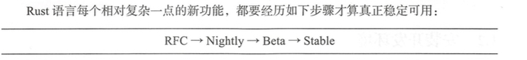
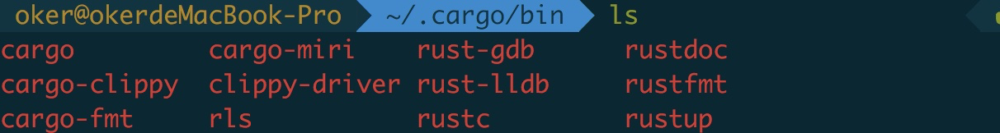

## 1 初识rust

Rust语言的定位：

Rust is a system’s programming language that runs blazingly fast, prevents segfaults, and guarantees thread safety. 

Rust是一种运行速度飞快，不会出现段错误并且保证并发安全的系统级编程语言。

在传统的系统级编程语言 (CIC++) 的开发过程中，经常出现因各种内存错误引起的崩溃 或 bug。 比如空指针、野指针 、 内存泄漏 、 内存越界 、段错误 、 数据竞争、迭代器失效等，血 泪斑斑，数不胜数 。 这些问题不仅在教科书中被无数次提起，而且在实践中也极其常见 。 因 此，各种高于辛苦地总结了大量 的编程经验，许多代码检查和调试工具被开发出来，各种代 码开发流程和规范被制定出来，无数人呕心沥血就是为了系统性地防止各类 bug 的出现 。 尽 管如此，我们依然无法彻底解决这些问题。 


但是到目前为止，不管使用哪种算法的 GC系统，在性能上都要付出比较大的代价。  要么需要较大的运行时占用较大内存，要么需要 暂停整个程序，要么具备不确定性的时延 。 当然，在现实的许多业务场景中，这点开销是微 不足道的，因此问题不大。 可是如果在性能敏感的领域，这是完全不可接受的。 

Rust对自己的定位是接近芯片硬件的系统级编程语言，因此，它不可能选择使用**自动垃圾回收**的机制来解决问题。  

Rust编译器的后端是基于著名 的 LLVM 完成机器码生成和优化的，它只需要一个非常小 巧的运行时即可工作，执行效率上可与 **C 语言**相媲美 ，具备很好的跨平台特性 。 

Rust语言是完全**开源**的，不仅代码是开源的，而且整个设计过程 、思辩讨论 都是对社区完全开放的 。  


rust官网：https://www.rust-lang.org/ 

目前， C 和 C++应该是业界最流行**的系统编程语言** 。 Rust 的定位与它们类似，但是增加 了安全性。 C和C++都是编译型语言，无须规模庞大的运行时(runtime)支持，也没有自动内存回收( Garbage Collection)机制 。 


### rust版本和发布

Rust编程语言是开源的，编译器的源码位于 https://github.corn/rust-lang/rust项目中 

语 言设计和相关讨论位于 https://github.com/rust也ng/rfcs项目中 

Rust编译器的版本号采用了“语义化版本号”( Semantic Versioning)规划。 在这个规则之下，版本格式为:**主版本号.次版本号修订号**。 版本号递增规则如下。 

- 主版本号:当你做了不兼容的 API修改
- 次版本号:当你做了向下兼容的功能性新增
- 修订号:当你做了向下兼容的问题修正


Rust 的第一个正 式版本号是 1.0，是 2015 年 5 月发布的 。 从那以后，只要版本没有出现 

大规模的不兼容的升级，大版本号就一直维持在“ l”，而次版本号会逐步升级。 Rust一般以 6个星期更新一个正式版本的速度进行迭代 。 


为了兼顾更新速度以及稳定性， Rust使用了多渠道发布的策略: 

- nightly版本
- beta版本
- stable版本
   

nightly 版本 是每天在主版本上自动创建出来的版本，这个版本上的功能最多，更新最 

快，但是某些功能存在问题的可能性也更大 。 因为新功能会首先在这个版本上开启，供用户试用。 beta版本是每隔一段时间，将一些在 nightly版本中验证过的功能开放给用户使用。 它 可以被看作 stable 版本的“预发布”版本 。 而 stable 版本则是正式版，它每隔 6 个星期发布 一个新版本，一些实验性质的新功能在此版本上无法使用 。 它也是最稳定、最可靠的版本 。 **stable 版本是保证向前兼容的** 。 


在 nightly 版本中使用试验’性质的功能，必须手动开启 feature gate。 也就是说要在当前项 目的人口文件中加入一条`# ![feature(...name···)]`语句。 否则是编译不过的。 等到这个 功能最终被稳定了 ，再用新版编译器编译的时候，它会警告你这个 feature gate 现在是多余的了，可以去掉了 。




Rust 的标准库文档位于 https://doc.rust-lang.org/std/。 学会查阅标准库文档，是每个 Rust 使用者的必备技能之一 。 


### rust安装

https://www.rust-lang.org/tools/install

一般我们不单独下载Rust的编译器， 而是使用一个叫rustup的工具安装 Rust相关的一整套工具链， 包括编译器、 标准库、 cargo等。 使用这个工具，我们还可以轻 易地更新版本、 切换渠道、多工具链管理等。 


路径：$HOME/.cargo/bin




- rustc是编译器
- cargo是包管理器
- cargo-fmt和rustfmt是源代码格式化工具
- rust-gdb、rust-lldb是调试器
- rustdoc是文档生成器
- rls、racer是为编辑器准备的代码提示工具
- rustup是管理这套工具链下载更新的工具


版本切换：

```shell
// 安装 nightly 版本的编译工具链 
$ rustup install nightly
// 设置默认工具链是 nightly版本 
$ rustup default nightly
```


### rust是代理服务(在公司使用不好使,暂且不要使用代理)

为了提高访问速度，中国科技大学 Linux用户协会( USTC LUG) 提供了一个代理服务 ， 官方网址为 https://lug.ustc.edu.cn/wiki/mirrors/help/rust-static，建议国内用户设置好以下环境变量再使用 rustup: 

export RUSTUP_DIST_SERVER=https://mirrors.ustc.edu.cn/rust-static
export RUSTUP_UPDATE_ROOT=https://mirrors.ustc.edu.cn/rust-static/rustup 


### rust的包管理工具

Rust 官方工具链还提供了重要的包管理工具 cargo.exe，我们可以通过这个工具轻松导人 或者发布开源库。 官方的管理仓库在 https://crates.io/，大家可以登录这个网站浏览一下 Rust 社区热 门的开源库都有哪些 。 


大型项目往往需要依赖这些开源库， cargo 会帮我们自动下载编译 。 同样，为了解决网络问题 ，需要利用 USTC 提供的代理服务，使用方式为 : 在 $HOME/. cargo 目录下创建一个名为 config 的文本文件， 其内容为: 

```
[source.crates-io]
registry = "https: //github.com/rust-lang/crates.io-index"
replace-with = 'ustc'
[source.ustc]
registry = "git://mirrors.ustc.edu.cn/crates.io-index"
```

这样，在编译需要依赖 crates.io 的项目时，不会由于网络问题导致依赖库下载失败 。 

### rust编辑器增强工具

RLS(RustLanguageServer)是官方提供的一个标准化的编辑器增强工具。 它也是**开源**的， 项目地址在 https://github.com/rust-lang-nursery/rls。 它是一个单独的进程，通过进程间通信给 编辑器或者集成开发环境提供一些信息，实现比较复杂的功能，比如代码自动提示、跳转到 定义、显示函数签名等 。 安装最新的 RLS 的方法为: 

```shell
// 更新 rustup 到最新
rustup self update
// 更新 rust 编译器到最新的 nightly 版本
rustup update nightly
//安装 RLS
rustup component add rls --toolchain nightly
rustup component add rust-analysis --toolchain nightly 
rustup component add rust-src --toolchain nightly
```

有了这些准备，大家就可以在 Visual Studio Code 中下载支持 Rust 的插件，提升编辑体验。理论上来说， RLS 可以眼任何编辑器或者集成开发环境配合使用，只要这个编辑器实现了它们之间的通信协议即可。 

### 开始rust之旅

```shell
$ rustc -V
```


一般 Rust源代码的后缀名使用 .rs表示 。 源码一定要注意使用 utf-8 编码。

```rust
fn main() {
	let s = "hello world!";
	println!("{}",s);
}
```

fn是一个关键宇(keyword)，函数定义必须以这个关键字开头。 函数体使用大括号来包含 。 也是单词在mction 的缩写 ，在Rust 中，设计者比较偏向使用**单词缩写**，即使是关键 字也不例外 。 在代码风格上，某些读者可能开始会有点不习惯 。 但总体而言，这只是个审美偏好而已，不必过于纠结，习惯就好 。

main是一个无参数无返回值的函数。

编译：

```shell
$ rustc hello_world.rs
```

可看到本地文件夹中生成了一个名为 hello world 的可 执行程序 。 执行. /hello world程序，可以看见控制台上输出了 hello world! 字符串。 


局部变量声明使用 **let关键字**开头，用双引号包含起来的部分是字符串常量。 

Rust 是**静态强类型语言**，所有的变量都有严格的编译期语法检查。 

每条语句使用**分号**结尾 。

### rust中最简单的标准输出

最简单的标准输出是使用 `println !` 宏来完成 。 请大家一定注意 println 后面的**感叹号**， 它代表这是一个**宏**，而不是一个函数 。 


Rust 中的宏与 CIC++ 中的宏是完全不 一样的东西 。 简单点说，可以把它理解为一种安全版的**编译期语法扩展** 。 这里之所以使用宏，而不是函数，是因为**标准输出宏可以完成编译期格式检查** ， 更加安全。 

### rust中的项目

Rust 的代码从逻辑上是分 `crate` 和 `mod` 管理的 。 所谓 crate 大家可以理解为“项目” 。 每个 crate 是一个完整的**编译单元**，它可以生成为一个 lib 或者 exe 可执行文件 。 而在 crate 内部， 则是由 mod这个概念管理的，所谓 mod大家可以理解为 **namespace**。 我们可以使用 **use 语句**把其他模块中的内容引入到当前模块中来 。 


### Prelude

Rust 有一个**极简标准库**， 叫作 `std`，除了极少数嵌入式系统下无法使用标准库之外，绝大部分情况下，我们都需要用到标准库里面的东西。 为了给大家减少麻烦， Rust编译器对标准库有特殊处理。 默认情况下，用户不需要手动添加对标准库的依赖 ，编译器会**自动引入**对标准库的依赖。 除此之外，标准库中的某些 type、 trait、 function、 macro等实在是太常用了。 每次都写 use语句确实非常无聊，因此标准库提供了 一个` std::prelude` 模块，在这个模块中导出了一些最常见的类型、trait等东西编译器会为用户写的每个 crate 自动插入一句话: 

```rust
use std::prelude::*;
```


Prelude模块 的源码在 src/libstd/prelude/文件夹下 

### Format格式详细说明

```rust
fn main() {
    println!("{}",1);       // 默认用法，打印Display
    println!("{:o}",9);        // 八进制
    println!("{:x}",15);        // 十六进制 小写
    println!("{:X}",17);        // 十六进制 大写
    println!("{:p}",&0);        // 指针
    println!("{:b}",15);        // 二进制
    println!("{:e}",1000f32);   // 科学计数 (小写)
    println!("{:E}",1000f32);   // 科学计数 (大写)
    println!("{:?}","test");    // 打印 Debug
    println!("{:#?}",("test1","test2"));    // 带换行和缩进的Debug打印
    println!("{a} {b} {b} {c}",a="wgy",b=1024,c=1.024); // 命名参数
}
```

Rust标准库中之所以设计了这么一个宏来做标准输出，主要是为了更好地**错误检查** 。 大 家可 以试试，如果出现参数个数、格式等各种原因不匹配会直接**导致编译错误** 。 而函数则不具备字符串格式化的静态检查功能，如果出现了不匹配的情况 ，只能是运行期错误。  