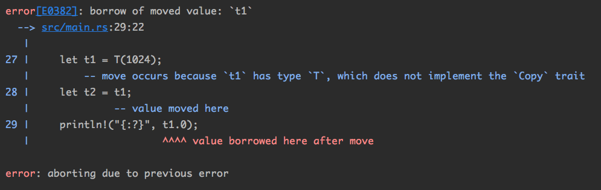
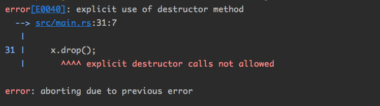
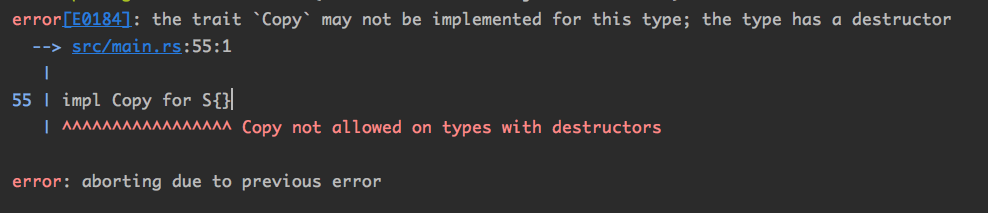
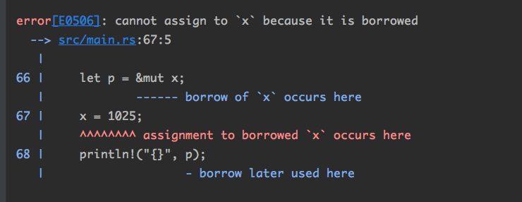

## 11.所有权和移动语义（暂）

```c++
#include <iostream>
using namespace std;
int main() {
	string s (”hello”); 
  // 在用变量 s 初始化 s1 的时候，并不会造成 s 的生命周期结束 
  // 这里只会调用string类型的复制构造函数复制出一个新的字符串
  string s1 = s;
  cout < S < endl;
  cout < 51 < endl; 
  return O;
}
```

在 Rust中， 我们要模拟这一行为，需要手动调用 clone()方法来完成:

```rust
fn main() {
	lets= String::from("hello"); 
  let s1 = s.clone(); 
  println!("{} {}", s, sl);
}
```

在Rust里面，不可以做“赋值运算符重载”，若需要“深复制”，必须于工调用clone方法 。

 这个clone方法来自于std::clone::Clone 这个trait。 clone 方法里面的行为是可以自定义的 。

### 11.1 所有权转移

Rust中所有权转移的重要特点是，它是所有类型的**默认语义** 。 这是初学者一开始不习惯的地方。 

这里再重复一遍，请大家牢牢记住，Rust中的变量绑定操作，默认是`move`语义，执行了新的变量绑定后，原来的变量就不能再被使用 ! 一定要记住!

Rust的这一规定非常有利于编译器**静态检查**，C++的做法就不一样了，它允许赋值构造函数、赋值运算符重载，因此在出现 “构造”或者“赋值”操作的时候，有可能表达的是完全不同的含义，这取决于程序员如何实现重载 。 

在 C++里面， `std::vector<int> v1 = v2`; 是复制语义，而 Rust里面的 `let v1:Vec<i32> = v2 ;`是移动语义。 如果要在Rust里面实现复制语义，需要显式写出函数调用 `let v1:Vec<i32> = v2.clone();`。 

强调一下：“语义”不代表最终的执行效率。 “语义”只是规定了什么样的代码是编译器可以接受的，以及它执行后的效果可以用怎样的思维模型去理解 。 编译器有权在不改变语义的情况下做任何有利于执行效率的**优化** 。

我们可以把移动语义想象成执行了一个 memcpy，但真实的**汇编代码**未必如此。例如：

```rust
fn create () -> BigObject {
	let local = ...;
  return local;
}

let v =create();
```

上面代码完全有可能被优化为如下逻辑：

```rust
fn create(p: &mut BigObject) { 
  ptr::write(p, ···) ;
}
let mut v: BigObject = uninitialized(); 
create(&mut v);
```

编译器可以提前在**当前调用栈**中把大对象的空间分配好，然后把这个对象的**指针**传递给子函数，由子函数执行这个变量的初始化。 

这样就避免了大对象的**复制工作**，参数传递只是一个指针而已 。 

### 11.2 复制语义

默认的**move语义**是Rust的一个重要设计，但是任何时候需要复制都去调用`clone函数`会显得非常烦琐。 对于一些**简单类型**，比如整数、 bool，让它们在赋值的时候默认采用复制操作会让语言更简单 。

```rust
let v1 : isize = O; 
let v2 = v1; 
println! ("{}", v1);
```

编译器并没有阻止 v1 被使用。因为在Rust中有一部分“特殊照顾”的类型，其变量绑定操作是copy语义 。即：

```rust
let v2 = v1;
// 等效于
let v2 = v1.clone();
```

Rust中，在普通变量绑定、函数传参、模式匹配等场景下，凡是实现了`std::marker::Copy`trait的类型，都会执行copy语义。

基本类型，比如数字、字符、bool等，都实现了`Copy` trait，因此具备copy语义。

对于自定义类型，默认是没有实现`Copy`trait的， 但是我们可以手动添上。由于Copy继承了Clone，所以要实现 `Copy`trait必须同时实现`Clone`trait。

```rust
struct Foo {
    data: i32
}

impl Clone for Foo {
    fn clone(&self) -> Self {
        Foo { data: self.data }
    }
}

impl Copy for Foo {}

fn main(){
  let v1 = Foo { data: 1024 };
    let v2 = v1;
    println!("{:?}", v1.data);
}
```

现在`Foo`类型也拥有了**复制语义**。在执行变量绑定 、函数参数传递的时候，原来的变量不会失效，而是会新开辟一块内存，将原来的数据复制过来 。

绝大部分情况下， 实现`Copy`trait和`Clone` trait是一个非常机械化的、重复性的工 作， clone方法的函数体要对每个成员调用一下clone方法。 

可以利用编译器拓展——**derive attribute**

```rust
fn main(){
    let v1 = Foo { data: 1024 };
    let v2 = v1;
    println!("{:?}", v1.data);
}

#[derive(Copy, Clone)]
struct Foo {
    data: i32
}
```

### 11.3 Box类型

Rust中一种常用的指针类型，代表“拥有所有权的指针”。用法如下：

```rust
fn main() {
    let p = Box::new(Foo { data: 1024 });
    println!("{}", p.data);
}

struct Foo {
    data: i32
}
```

**Box 类型永远执行的是move语义，不能是copy语义** !

原因：很容易理解，Rust的copy语义就是复制一个副本，但是对于Box这样的“指针”而言，潜复制必然会造成**内存空间二次释放**的问题。

对于`Box<T>`/`&T`/`&mut T`这样的类型，合理初始化意味着它一定指向了某个具体的对象——**不能为空**。

如果需要使用“可能为空的”指针，必须使用类型`Option<Box<T>>`

Rust里还有一个保留关键字`box`（小写），它用于把变量“装箱”到**堆**上。目前这个语法依然是unstable的，需要打开`feature gate`才能使用：

```rust
#![feature(box_syntax)]

fn main() {
  // 该写法与Box::new()并没有本质区别
    let p = box Foo { data: 1024 };
    println!("{}", p.data);
}

struct Foo {
    data: i32
}
```

将来`box`关键字可能会同样支持各种智能指针，从而根据上下文信息自动判断执行。比如：`let p:Rc<T>=box T{data:1024};`就可以构造一个Rc指针。

### 11.4 Clone VS. Copy

`Copy` trait 给类型提供了“复制”语义。在Rust标准库里还有一个跟它相近的trait——Clone。来看看这两个trait的联系与区别。

#### 11.4.1 Copy

全名是std::marker::Copy。

注意：std::marker模块里面所有的trait都是特殊的trait。目前稳定的有4个：`Copy`、`Send`、`Sized`、`Sync`。他们特殊之处在于——跟编译器密切绑定。

在编译器眼中，`std::marker`中的trait与其他trait不一样。这四个trait内部是没有方法的，它们唯一的任务就是给类型打个“标记”，表明它符合某种约定。

一旦一个类型实现了Copy trait，那么它在**变量绑定**、**函数参数传递** 、**函数返回值传递**等场景下 ，都是**copy语义**。

在Rust里， move语义和copy语义具体执行的操作，是**不允许由程序员自定义**的，这是它和 C++的巨大区别。

什么是语义角度？就是要讲清楚什么样的代码在编译器看来是合法的，什么样是非法的。

如果考虑后端优化，在许多情况下，不必要的内存复制实际上已经彻底优化掉了，大家不必担心**执行效率**的问题。 也没有必要每次都把move或者copy操作与具体的**汇编代码**联系起来，因为场景不同，优化结果不同，生成的代码也是不同的 。

需要注意的是：并不是所有的类型都可以实现Copy trait。Rust规定：对于**自定义类型**，只有其**所有成员**都实现了Copy trait，这个类型才有资格实现Copy trait。

常见的数字类型、 bool类型、共享借用指针 &，都是具有Copy属性的类型 。 而Box、Vec、可写借用指针&mut等类型都是不具备Copy属性的类型。（想想为什么不具备？）

对于数组类型和tuple，如果它内部的元素类型是Copy，那么这个数组也是Copy类型。（自动实现）

struct和 enum类型**不会自动实现**Copy trait。只有当struct和enum内部的每个元素都是Copy类型时，编译器才允许我们针对此类型实现Copy trait。

```rust
fn main() {
    let t1 = T(1024);
    let t2 = t1;
    println!("{}", t1);
}

struct T(i32);
```

编译报错：



但是我们可以手动为其实现：

```rust
fn main() {
    let t1 = T(1024);
    let t2 = t1;
    println!("{}", t1);
}
// 如果要实现Copy，必须实现Clone
#[derive(Debug,Copy,Clone)]
struct T(i32);
```

#### 11.4.2 Clone

```rust
pub trait Clone : Sized {
		// 没有默认实现，需要程序员自己定义
    fn clone(&self) -> Self;
		// 有默认实现
    fn clone_from(&mut self, source: &Self) {
        *self = source.clone()
    }
}
```

注：对于Box类型， clone执行的是**“深复制”**；而对于 Rc 类型， clone 做的事情就是把引用计数值加 1。

Rust中clone方法一般是用来执行**复制操作**的，那程序员在实现clone函数时做点其他工作，编译器也是没有办法禁止的，但是有一点需要注意：

对于实现了Copy trait的类型，它的clone方法应该跟`copy语义`相容，等同于按字节复制。

#### 11.4.3 自动derive

原因：绝大多数情况下 ，实现 `Copy`和` Clone`这样的trait都是一个重复而无聊的工作 。

```rust
#[derive(Copy,Clone)]
struct S {
  data : i32
}
```

这样编译器会自动帮我们生成`impl Copy`和`impl Clone`这样的代码 。

但是，通过derive方式自动实现`Copy` trait和手工实现`Copy` trait有一个细微的区别：

当类型具有**泛型参数**的时候，比如`struct S<T>`{} ，通过derive自动生成的代码会自动添加一个 `T:Copy` 的约束。

#### 11.4.4 Copy与Clone 不同

- Copy 内部**没有**方法， Clone内部有**两个**方法 ；
- Copy trait是给编译器用的，目的是告诉编译器该类型默认采用`copy语义`，而不是`move 语义`，Clone trait是给程序员用的，必须手动调用clone方法，它才能发挥作用（底层是如何进行克隆的需要指出） 。
- Copy trait不是任何类型都可以是实现的，而Clone trait则几乎可以适用于所有类型。

### 11.5 析构函数

构造函数(constructor)  <=>  析构函数(destructor)，Rust中没有统一的“构造函数”一说，直接在对象初始化时完成，一般将对象的创建都封装到普通的静态函数中。

析构函数有更重要的作用，它会在对象消亡之前由编译器自动调用，特别适合承担对象销毁时释放所拥有的资源的作用。

析构函数不仅可以用于管理内存资源，还能用于管理更多的其他资源，如文件、锁 、socket 等 。

Rust中如何编写析构函数？实现`std::ops::Drop`

```rust
struct S {
    data:i32
}

impl Drop for S{
    fn drop(&mut self) {
        // 在这里添加你自己需要另加的逻辑（在对象析构时调用）
        println!("drop me!")
    }
}

fn main() {
  let x = S { data: 1024 };
    println!("{}", 1);
    {
        let y = S { data: 1025 };
        println!("{}", 2);
    }
    println!("{}", 3);
}

// 1
// 2
// drop me!
// 3
// drop me!
```

#### 11.5.1 主动析构

一般情况下，局部变量的生命周期是从它的声明开始，到当前语句块结束。 

注意：程序员手动**提前调用**析构函数来结束变量的生命周期是非法的。

```rust
 		let x = S { data: 1024 }; // S已实现Drop trait
    x.drop(); // 编译报错 
```



如何做到主动析构？

调用标准库中的`std::mem::drop`函数

```rust
use std::mem::drop;		

		let x = S { data: 1024 };
    drop(x);
    println!("{:?}", x) // 编译报错
```

这个标准库中drop析构函数的实现是Rust最简单的实现：

```rust
pub fn drop<T>(_x: T) { }
// 实现为空
```

drop函数需要做的就是“**什么都不要做**”，只需要参数为“**值传递**”即可。将对象的所有权移入函数中，编译器就会自动释放掉这个对象。

因为是转移所有权，所以drop函数的参数类型必须是`T`，而不可以是`&T`或者其他引用类型。

注意：对于实现Copy trait类型的变量 ，对它调用 `std::mem::drop` 函数是没有意义的。为啥？因为传入drop函数的实参会自动复，最后释放掉的只是一个复制品。

变量遮掩不会导致变量生命周期提前结束，它并不等同于drop：

```rust
fn main() {
    let x = S { data: 1024 };
    println!("1");
    let x = S { data: 2048 };
    println!("2");
}

struct S {
    data: i32
}

impl Drop for S {
    fn drop(&mut self) {
        println!("drop me!")
    }
}

// 1
// 2
// drop me!
// drop me!
```

证明变量遮掩不会提前析构变量。

还有个小问题需要注意：

如果用**下划线**来绑定一个变量，那么这个变量会当场执行**析构**，而不是等到当前语句块结束的时候再执行 。

```rust
let _ = S { data: 1024 };
```

#### 11.5.2 Drop VS. Copy

前面说过要实现Copy trait，必须满足一个条件：这个类型可以使用memcpy的方式执行复制操作，且没有内存安全问题。

那么记住下面这点：带有**析构函数**的类型都是不能满足Copy语义。编译器是**直接禁止**的 。

```rust
struct S {
    data: i32
}

impl Drop for S {
    fn drop(&mut self) {
        println!("drop me!")
    }
}
impl Copy for S{}
```

编译报错：



所以，Copy和Drop trait 是互斥的！

### 11.6 借用指针

对于&mut型指针，不要混淆它与变量绑定之间的语法。

如果mut修饰的是**变量名**，那么它代表这个变量可以被重新绑定 ;

```rust
let mut i = 1024; 
i = 1025
```

你看到i被修改了，实际上是绑定到了另外一个内存地址上；

如果mut修饰的是**借用指针 &**，那么代表被指向的对象可以被修改。 

```rust
// 方法1：
let ref mut i = 1024; // ref只能在等号左边，表示借用/引用
*i = 1025;

// 方法2：
let mut i =1024;
let p = &mut i;	// 在等号右边，才可以用&mut
*p = 1025;
```

**借用指针**在编译后，实际上就是一个普通的指针，它的意义只能在编译阶段的**静态检查**中体现 。

#### 11.6.1 借用规则

- 借用指针不能比它指向的变量存在的时间更长，否则会出现悬空指针；
- &mut只能指向本身具有mut修饰的变量，对于只读变量不可以：

```rust
		// 错误例子		
		let i = 1024;
    let p = &mut i;
```

- &mut型借用指针存在的时候，被借用的变量本身会处于“冻结” 状态；
- 如果只有**&型借用指针**，那么能同时存在多个；如果存在**&mut型借用指针**，那么只能存在一个；如果同时有**其他**的&或者&mut型借用指针存在，那么会出现编译错误 。

提醒：

一般情况下，函数参数使用**引用传递**的时候，不仅在函数**声明处**要写上类型参数，在函数调用这里也要显式地使用引用运算符：

```rust
// 函数声明处要写上类型参数
fn func1(v: &Vec<i32>) {}
    
		let arr = vec![1];
		// 函数调用也要显式使用引用运算符
    func1(&arr);
```

但是有个例外：当参数为 self /&self/&mut self 等时，若使用小数点语法调用成员方法，在函数调用这里**不能显式**写出借用运算符 。

```rust
		let x: String = "michael.w".into();
// 小数点调用成员方法不能显式写出借用运算符
    println!("{}", x.len());
    println!("{}", String::len(&x));
```

任何**借用指针**的存在， 都会导致原来的变量被“冻结”。

```rust
		let mut x = 1024i32;
    let p = &mut x;
    x = 1025;
    println!("{}", p);
```

编译报错：



因为p的存在，直接对x的改变被认为是非法的 。

