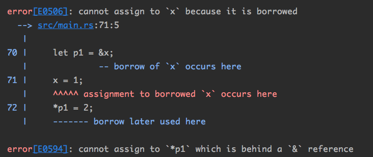
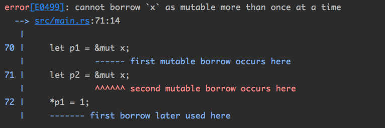
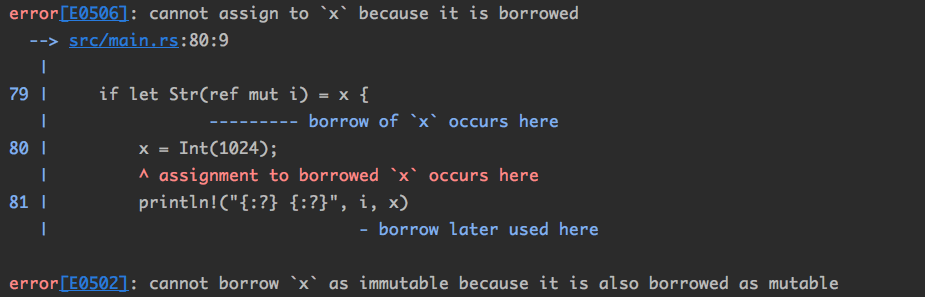
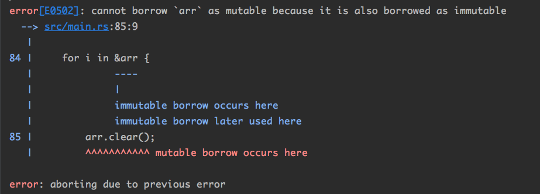
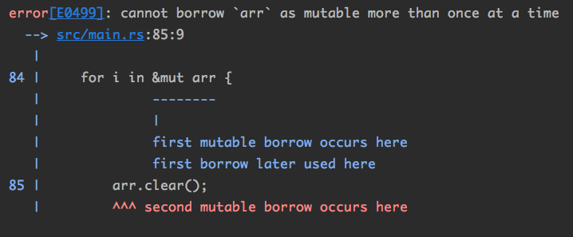
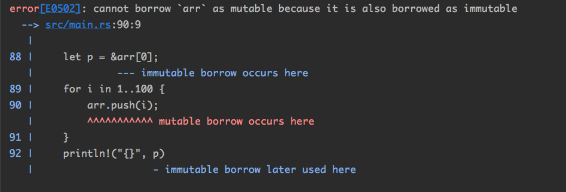

## 12.借用检查

Rust语言的核心特点是：在没有放弃对内存的**直接控制力**的情况下，实现了内存安全 。

Rust 的设计者们在一系列的“内存不安全”的问题中观察到了这样的一个结论 :

```
Danger arises from Aliasing + Mutation
```

- Alias：别名。如果一个变量可以通过多种Path来访问，那它们就可以互相看作alias。 Alias 意味着“共享 ”，可以通过多个入口访问同一块内存 。
- Mutation：改变。Mutation意味着拥有“修改”权限，我们可以通过某个变量修改一块内存 。

Rust保证内存安全的一个重要原则：

如果能保证alias和mutation不同时出现，那么代码就一定是安全的 。

即：**共享不可变，可变不共享。**

看几个例子：

Demo1：

```rust
 		let x = 0;
    let p1 = &x;
    let p2 = &x;
    println!("{} {} {}", x, p1, p2); // 0 0 0
```

可以通过不同的Path访问同一块内存，x/p1/p2在“共享内存”，而且他们只有只读权限——存在“共享”，不存在“可变”。因此一定是安全的。

Demo2：

```rust
		let mut x = 0;
    let p1 = &x;
    x = 1;
    *p1 = 2;
```

编译报错：



在存在**只读借用**的情况下，变量x和p1已经互为alias，存在共享，因此必须避免“可变”。

```rust
		let mut x = 0;
    let p1 = &mut x;
    let p2 = &mut x;
    *p1 = 1;
    *p2 = 2;
```

创建两个可变借用，编译报错：



Rust不允许**大于1个**的可变借用指向同一个变量。

正因如此，**&mut型借用**也经常被称为“独占指针”， **&型借用**也经常被称为“共享指针” 。

### 12.1 内存不安全Demo

#### 12.1.1 修改枚举

定义一个枚举（两元素，一个String，一个Int）：

```rust
#[derive(Debug)]
enum E {
    Str(String),
    Int(i32),
}
```

假如我想用一个引用指向其内部，同时再修改这个变量，会发生什么？

```rust
		use E::{Str, Int};
    let mut x = Str("michael.w".to_string());
    if let Str(ref i) = x {
        x = Int(1024);
        println!("{:?} {:?}", i, x)
    }
```

这是一个典型的内存不安全场景，还好编译器直接报错：



这时候理解了为什么Rust一定要“可变性”和“共享性”不能同时存在了吧！保证当前**只有一个访问入口**是最安全保靠的做法。

#### 12.1.2 迭代器失效

如果在遍历一个容器时修改这个容器中的数据也是一个典型的内存不安全场景：

```rust
		let mut arr = vec![1, 2, 3, 4];
// 迭代器遍历
    for i in &arr {
        arr.clear();
    }
```

编译报错：



 Rust里面的for循环实质上是**生成了一个迭代器**，它一直持有一个指向容器的**引用**（这也是为什么Rust for range的时候都是针对**借用指针**）。

这样，在迭代器的生命周期内，任何对容器的修改都是无法编译通过的。

耍个小聪明再试试：

```rust
		let mut arr = vec![1, 2, 3, 4];
// 我改个&mut是不是就可以修改了呢？
    for i in &mut arr {
        arr.clear();
    }
```



不允许有两个“可变”引用同时活在世上。可是我明明只定义了一个&mut用于for循环：

注意一下clear()方法的定义：

```rust
		#[inline]
    #[stable(feature = "rust1", since = "1.0.0")]
// 必然产生对原Vec的&mut型引用。
    pub fn clear(&mut self) {
        self.truncate(0)
    }
```

所以，Rust通过“alias + mutation”规则，完全杜绝了迭代器失效这样的经典内存事故。

类似这样的问题依靠GC是没办法处理的。因为GC只关心内存的**分配和释放**，对于变量的**读写权限**并不关心。

所以GC在此处发挥不了什么作用 。

#### 12.1.3 悬空指针

看一个C++的事故现场：

```c++
#include <vector>
#include <iostream>

using namespace std;
int main() {
  vector<int> v(100,5);
  int * p =&v[0];
  cout << *p << endl;
  for (int i=0;i<100;i++){
    v.push_back(1024);
  }
  cout << *p << endl;
  return 0
}
// 通过编译
// 打印结果：
// 5 
// -78924612
```

想动态数组中添加元素，当超过了当前的最大容量， 动态数组会申请一块更大的连续内存空间，将原来的元素复制过去，并释放原来的内存空间。

Golang的切片同样是这个原理。

看看Rust：

```rust
		let mut arr = vec![1, 2, 3];
    let p = &arr[0];
    for i in 1..100 {
        arr.push(i);
    }
// 此时p指针已经成悬空指针
    println!("{}", p)
```

编译报错：



p指针当然可以成为悬空指针，Rust无法阻止，但是Rust将悬空指针设置为**不可读**。

“ mutation+alias”规则再次起了作用 。

写Rust的时候总感觉：编译器不近人情地严格，但是大部分时候却又发现，它指出来的问题的确是对编程是有益的。 对它使用越熟练，越觉得它是一个好帮手。