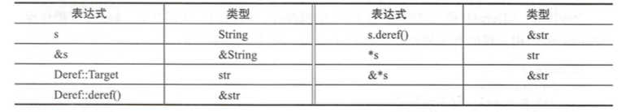
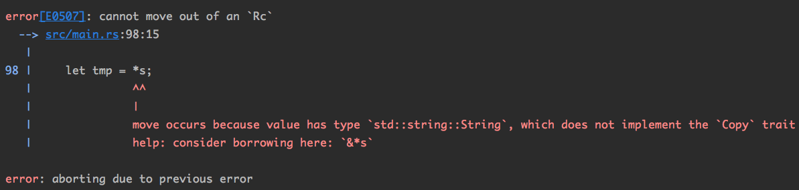
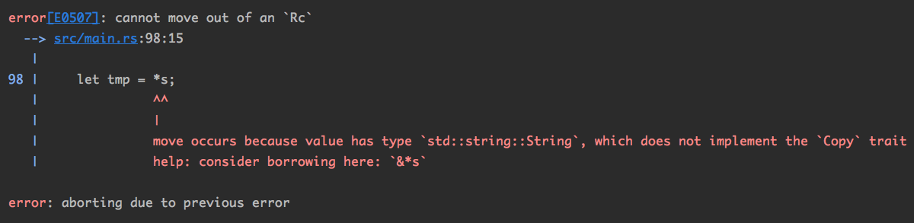

## 13.解引用

“解引用”（Deref）是“取引用”（Ref）的反操作。 取引用有`&、&mut`等操作符，解引用有``*操作符（宏观同C）。

### 13.1 自定义解引用

解引用操作可以被自定义 。 

做法：实现trait：

- `std::ops::Deref `
- `std::ops::DerefMut`

DerefMut同Deref唯一的区别就是返回的是`&mut`型引用，其余都类似。

它们的定义：

```rust
#[lang = "deref"]
#[doc(alias = "*")]
#[doc(alias = "&*")]
#[stable(feature = "rust1", since = "1.0.0")]
pub trait Deref {
    /// The resulting type after dereferencing.
    #[stable(feature = "rust1", since = "1.0.0")]
  // 注意这个Target关联类型
    type Target: ?Sized;

    /// Dereferences the value.
    #[must_use]
    #[stable(feature = "rust1", since = "1.0.0")]
    fn deref(&self) -> &Self::Target;
}


#[lang = "deref_mut"]
#[doc(alias = "*")]
#[stable(feature = "rust1", since = "1.0.0")]
pub trait DerefMut: Deref {
    /// Mutably dereferences the value.
    #[stable(feature = "rust1", since = "1.0.0")]
    fn deref_mut(&mut self) -> &mut Self::Target;
}
```

Deref中有一个关联类型——Target，代表解引用之后的对象类型。DerefMut继承了Deref，并多了一个自己特有的内联方法`fn deref_mut(&mut self) -> &mut Self::Target`

看一下标注库中是怎么实现String向str的解引用定义的：

```rust
#[stable(feature = "rust1", since = "1.0.0")]
impl ops::Deref for String {
  
    type Target = str;

    #[inline]
  // 注意这里：返回值类型是&Target，不是Target本身
    fn deref(&self) -> &str {
        unsafe { str::from_utf8_unchecked(&self.vec) }
    }
}
```

那上面deref返回值说明了什么？

如果说String类型有个变量s，那么*s的类型并不是s.deref()的类型。

由定义可知s.deref()的类型是&Target，即&str。

这就有些糊涂了，Rust里面自带的两种字符串类型`String`和`str`直接的引用/解引用关系到底是什么呢？



所以，牢记`*expr`的类型是Target，而Deref::deref()返回值却是&Target。这个与直观理解具有偏差。

标准库中有很多十分常用的类型实现了这个Deref操作符，比如：`Vec<T>`、`String`、`Box<T>`和`Rc<T>`。

这些类型都支持“解引用”操作，那意味这什么？

这就意味着他们都可以算作一种“指针”。就像前面讲到的胖指针一样，是带有额外元数据的指针，一般都称呼这些类型为“智能指针”。

宏观理解一下这些“智能指针”：

- `Box<T>`指向一个在堆上分配的对象——如果你想让你的变量对象直接在存储在堆上，就用这个`Box<T>`来初始化；
- `Vec<T>`指向一组同类型的顺序排列的**堆**上分配的对象，且携带有当前缓存空间总大小和元素个数大小的元数据（跟Golang的切片实现几乎一模一样）;
- `String` 指向的是一个**堆**上分配的**字节数组**， 其中保存的内容是合法的**utf8**字符序列。 且携带有当前缓存空间总大小和字符串实际长度的元数据。这也是为什么String类型是可以修改的，而str是不可修改的。

注：以上类型对其所指向的内容拥有所有权，管理者它们指向内存空间的分配和释放——意味着程序员不需要去直接管理这些指针所指向对象的内存释放，直接通过管理该指针即可。

### 13.2 自动解引用

Rust提供的“自动解引用”机制，在某些场景下“隐式地”帮我们做事情：

```rust
		let s = "michael.w";
    println!("{}", s.len());
    println!("{}", (&s).len());
    println!("{}", (&&&&&&&&&&&&&s).len());
// 9
// 9
// 9
```

第三个奇不奇怪？

看一下len()方法的定义：

```rust
		pub const fn len(&self) -> usize {
        self.as_bytes().len()
    }
```

其接收者是&self，所以除了用小数点的方式来调用外还可以用`str::len(&s)`的UFCS语法调用。但是为什么用`&&&&&&&&&&&&&s`来调用成员方法也可以呢？

这是因为Rust编译器做了隐式的deref调用。当它在`&&&&&s`类型里面找不到len方法时，隐式将它deref变成`&&&&s`接着找。找不到继续deref到`&&&s`中找，以此循环，终于在`&s`中

#### 13.2.1 自动解引用的用处

看一下Rc这个“智能指针”在标准库中的定义：

```rust
#[stable(feature = "rust1", since = "1.0.0")]
impl<T: ?Sized> Deref for Rc<T> {
  // 注意Target的类型是泛型  
  type Target = T;

    #[inline(always)]
    fn deref(&self) -> &T {
        &self.inner().value
    }
}
```

这么设计有什么好处呢？

```rust
use std::rc::Rc;

fn main() {
		let s = Rc::new(String::from("michael.w"));
    println!("{:?}", s.bytes());
}
// Bytes(Cloned { it: Iter([109, 105, 99, 104, 97, 101, 108, 46, 119]) })
```

Rc类型并没有bytes()方法，怎么就能执行bytes()方法呢？

这就是自动解引用的用处，编译器找不到Rc类型的bytes()方法，它会继续deref，试试s.deref().bytes()。但是String类型也没有bytes()方法，编译器继续deref，试试s.deref().deref().bytes()，终于在str类型中找到了bytes()方法，编译通过。

实际上一下写法在编译器的“眼”里都是一样的：

```rust
		let s = Rc::new(String::from("michael.w"));
    println!("{:?}", s.len());
    println!("{:?}", s.deref().len());
    println!("{:?}", s.deref().deref().len());
    println!("{:?}", (*s).len());
    println!("{:?}", (*&s).len());
    println!("{:?}", (&**s).len());
```

这也就是为什么String类型需要实现Deref trait——为了让`&String`类型的变量可以在必要的时候自动转换为`& str`类型 。 

这也是为什么String类型的变量可以直接调用str类型的方法的直接原因。

同理，`Vec<T>`也实现了Deref trait，

```rust
#[stable(feature = "rust1", since = "1.0.0")]
impl<T> ops::Deref for Vec<T> {
  // Target是[T] 动态数组  
  type Target = [T];

    fn deref(&self) -> &[T] {
        unsafe {
            slice::from_raw_parts(self.as_ptr(), self.len)
        }
    }
}
```

所以，`&Vec<T>`类型的变量就可以在必要的时候自动转换为`&[ T]`数组切片类型——直观的讲`Vec<T>`类型的变量可以调用`[T]`的“类方法”。

`Rc<T>`类型也实现了Deref trait，目标类型是 T（函数定义见上）。所以，`Rc<T>`类型的变量就可以直接调用 T 类型的方法。

注意：`&*` 两个操作符连写跟分开写的含义是不同的。

```rust
		let s = Rc::new(String::from("michael.w"));
    let p = &*s; 
// 编译器通过
		

		let s = Rc::new(String::from("michael.w"));
    let tmp = *s;
    let p = &tmp;
// 编译器报错
```

当Rust编译器看到`&*s`连在一起时会直接理解为s.deref()，这时候p只是s的一个借用而已。

如果把这两个操作分开写，会先执行`*s`把内部的数据move出来，再对这个临时变量tmp取引用，这时候s已经被移走了，生命周期已经结束 。所以问题会出在`let tmp = *s;`

所以编译不通过的报错：



也可以这么说：不允许从Rc指针中将内部的内容解引用提出来

```rust
    let s = Rc::new(String::from("michael.w"));
    let tmp = *s;
```



综上所述，做出几点提醒：

Rust中允许一部分**运算符**可以由用户自定义行为，即“操作符重载” 。

- “解引用” 是一个非常重要的操作符，它允许**重载** 。（想想这个重载是怎么实现的）
- “取引用”操作符，`&`，`& mut`，是不允许重载的 。 
- `&T` 的类型一定是`T`，而`&*T`的类型未必就是`T`。

所以，也就知道为什么叫智能指针了吧！

- 因为它可以直接调用其内部的其他类型的成员方法。