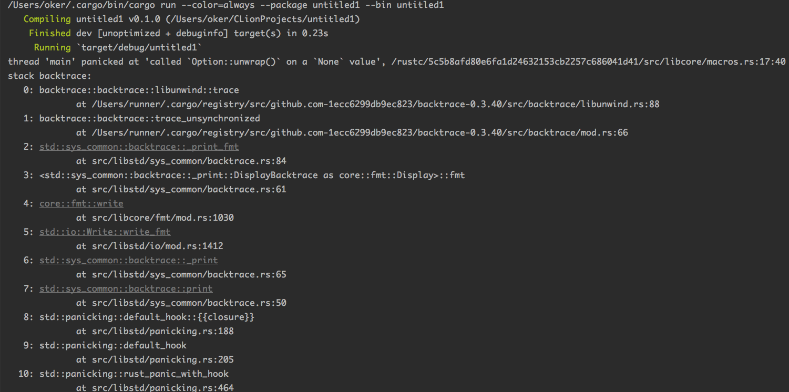
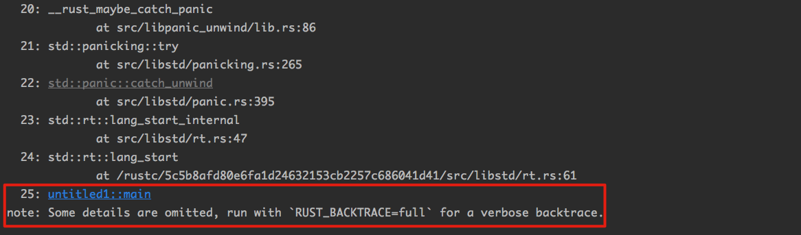
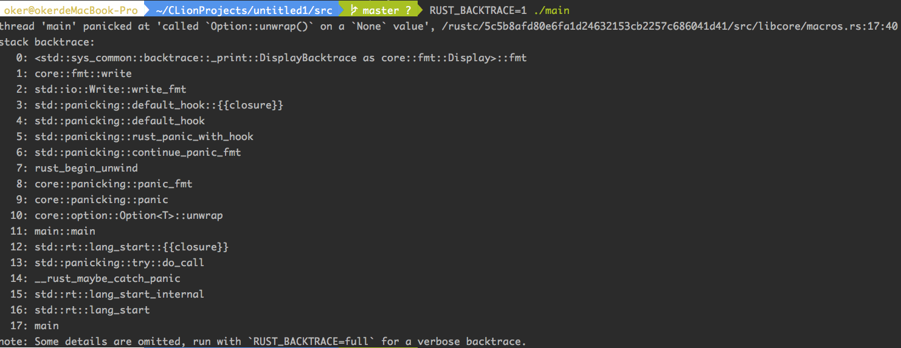
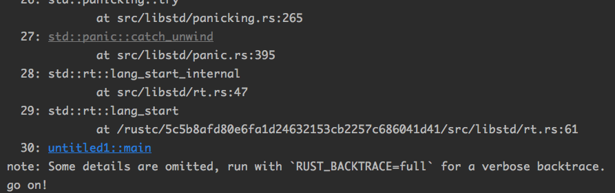

## 14.Panic

 前面都说Rust编译能通过，那么就几乎无法在运行过程中出现Panic。写个反例：

```rust
fn main() {
    let x: Option<i32> = None;
    x.unwrap();
}
```





根据提示 ，设置一个环境变量`RUST_BACKTRACE`之后再执行这个程序，可以看到这个程序在发生panic时候的函数调用栈。



究竟是什么导致了panic？看一下Option的unwrap方法：

```rust
		#[inline]
    #[stable(feature = "rust1", since = "1.0.0")]
    pub fn unwrap(self) -> T {
        match self {
            Some(val) => val,
            None => panic!("called `Option::unwrap()` on a `None` value"),
        }
    }
```

当其中数据为None时会发生panic。panic 如果没有被处理，它会导致整个程序崩溃 。

在 Rust 中，正常的错误处理应该尽量使用Result 类型 。 Panic 则是作为 一 种“fail fast”机制 ，不到万不得已建议不要使用。

所以， 一般情况下，用户应该使用unwrap_or()等不会制造panic的方法。

```rust
		let x: Option<i32> = None;
    x.unwrap_or(0); // 如果option为None,返回参数传入的值。
```

### 14.1 Panic的实现机制

在Rust中，Panic的实现机制有两种方式 : unwind 和 abort：

- unwind：发生panic时，会一层一层地退出函数调用栈。在此过程中，当前栈内的局部变量还可以正常析构；
- abort：直接退出整个程序。

所以，要注意，Rust并不是所有的Panic都会有调用栈信息返回的。

但是， unwind并不是在所有平台上都能获得良好支持的。一些嵌入式系统上， unwind根本无法实现，或者占用的资源太多。在这种时候可以选择使用abort方式实现 panic。

Rust编译器提供了一个选项，供程序员指定panic的实现方式：

```shell
# unwind方式
rustc -C panic=unwind main.rs

# abort方式
rustc -C panic=abort main.rs
```

可以利用catch_unwind阻止panic后函数调用栈的继续展开。这个就像C++里面的try-catch机制一样。

```rust
fn main() {
    panic::catch_unwind(|| {
        let x: Option<i32> = None;
        x.unwrap();
        println!("haha");
    }).ok();

    println!("go on!")
```



可见"haha"没有被执行，而"go on!"被执行了。

如果尝试使用“-C panic=abort”选项编译上面的代码，则catch_unwind起不到什么作用，最后的打印也不会执行。

注意：

**永远**不要利用这个catch机制来做正常的流程控制 ，Rust推荐的错误处理机制是用**返回值**。

因为如果继续执行下去就会有极其严重的内存安全问题（隐藏的），这种时候让程序继续执行导致的危害比崩溃更**严重**。此时 panic 就是最后的一种错误处理机制 。