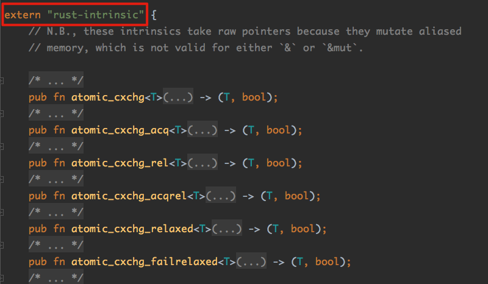

## 15.Unsafe

目前Rust的设计让人非常放心：

- 利用类型系统消除空指针；

- 简洁明了的 “唯一修改权”原则，消除了野指针

- 还有各种智能指针可以使用，甚至可以利用同样的规则消除多线程环境下的数据竞争。

这一切就像一组简洁的数学定理一样，构建了一整套清晰的“内存安全”代码的“世界观” 。

但是还有一些情况，Rust编译器的静态检查是不够用的。有些时候推理不出来这段代码究竟是不是安全的，这时我们就需要使用unsafe关键字来保证代码的**安全性**。

### 15.1 unsafe的用法

- 用于修饰函数fn；
- 用于修饰代码块；
- 用于修饰trait；
- 用于修饰impl；

如果一个函数被unsafe修饰的时候，意味着调用这个函数的时候要非常小心。它可能要求调用者满足一些**编译器无法自动检查出来**的重要的约束。

由unsafe修饰的函数，要么在**unsafe语句块**中调用，要么在**unsafe函数中调用**。

所以，unsafe函数具有“传递性”——unsafe函数的“调用者”必须也是**被unsafe修饰**的。看个例子：

```rust
#[inline]
#[stable(feature = "rust1", since = "1.0.0")]
pub unsafe fn from_raw_parts(buf: *mut u8, length: usize, capacity: usize) -> String {
		String { vec: Vec::from_raw_parts(buf, length, capacity) }
}

```

`String::from_raw_parts()`就是一个unsafe函数。为什么它是unsafe的呢？

因为String类型对所有者有一个保证：它内部存储的一定是**合法的utf-8**的字符串。而该函数并没有对传递进来的缓冲区（buf）进行该条件的检查，所以其是unsafe的。

而且程序员还必须这样调用：

```rust
let s = unsafe {
    String::from_raw_parts(...)
}
```

上面这个写法就是unsafe代码块的用法。使用unsafe关键字包围起来的代码块中可以做一些一般情况下不允许做的事情。

但是还是有要求的。与普通代码比起来，它多了以下几项能力：

- 对**裸指针**执行**解引用**操作；
- 读写**可变静态变量**；
- 读写union的**非Copy成员**；
- 调用**unsafe函数**。

当unsafe修饰一个trait时，那就意味着实现这个trait也需要使用unsafe。典型例子：线程安全中要说的`Send/Sync`这两个trait。

这两个trait很重要，是实现线程安全的根基。如果由程序员来告诉编译器：某个struct是否满足`Send/Sync`，那么程序员自己必须很谨慎且清楚地理解这两个trait所代表的真正含义——因为**编译器没有能力去推理验证这个impl是否正确**。

### 15.2 裸指针

前面说了许多智能指针，同时Rust提供了两种裸指针供我们使用：`*const T`和`*mut T`。前者不能修改所指向的数据，后者可以。

但是在unsafe代码块中，这两个裸指针是可以**相互转换**的。

#### 15.2.1 裸指针相对其他Rust指针的不同

裸指针相对于其他指针，如：`Box`，`&`，`&mut`有以下区别：

- 裸指针可以为空，并且编译器**无法保证**裸指针一定指向一个合法的内存地址；
- 不会对裸指针执行任何**自动化清理**工作（自动释放内存等）；
- 裸指针赋值操作就是简单的内存**浅复制**，并且不存在**借用检查**的限制。

```rust
		let mut y: u32 = 1;
    let x: i32 = 1;
		// 这里是安全的
    let raw_mut = &mut y as *mut u32 as *mut i32 as *mut i64;
		// 不安全了
    unsafe {
        *raw_mut = -1;
    }

    println!("{:X} {:X}", x, y);
// FFFFFFFF FFFFFFFF
// 注: 修改y值，结果将x值也给改了
```

注意以上过程，通过as关键字将变量y的`&mut`指针逐步转为裸指针：

原来变量y的类型是u32，为了将其转换为裸指针类型`*mut`，所以先转为`&mut`，进而一步一步转成裸指针`*mut i64`。

y和x都在栈中，且y先进栈，开始时他们的大小都是32位——4字节，y在x下面。而裸指针raw_mut类型为`*mut i64`，所以其修改变量直接修改64位——8字节。这样就把其上面的x的内容也给改了。

这也是为什么x的值会变成0xFFFFFFFF的原因。

再看个例子：

```rust
fn main() {
    let p = raw_to_ref(std::ptr::null::<i32>());
    println!("{}", p);
}

// 该函数将一个裸指针(*const)p转换成了一个共享引用(&i32)
fn raw_to_ref<'a>(p: *const i32) -> &'a i32 {
    unsafe {
        &*p
    }
}
```

编译后运行，竟发生了段错误：


上面代码在raw_to_ref函数中直接将一个裸指针（*const）转换为了共享引用（&i32）。

Rust里面的共享引用的规则：&型引用、&mut型引用以及Box指针必须是**合法的非空指针**。

在unsafe块中，程序员必须自己在逻辑上保证这点，编译器是检查不出来的。

如何改正呢？利用Option来处理存在空指针的情况：

```rust
// 返回值用Option包裹
fn raw_to_ref<'a>(p: *const i32) -> Option<&'a i32> {
  // 对输入进行空指针检查  
  if p.is_null() {
        None
    }else{
      // 真正的转换
        unsafe{
            Some(&*p)
        }
    }
}

fn main() {
    let p = raw_to_ref(std::ptr::null::<i32>());
    println!("{:?}", p);
}
// 编译通过，运行输出：
// None
```

注：**一个变量的&mut型引用最多只能同时存在一个**。这样的约束在unsafe的场景下很容易打破，而且编译器**无法**在静态编译阶段检测出来。

之所以需要unsafe，是因为有些代码只在特定条件下才是安全的（这种条件是无法利用Rust类型系统表达出来的），需要程序员自己来保证。

建议：不要到处滥用unsafe。当你使用unsafe的时候就相当于告诉编译器：“编译器大哥，请相信我，unsafe里面的代码我可以保证是安全的。我自己承担一起责任！”

ps：裸指针**不直接**支持**算数运算**，而是提供了一系列成员方法`offset wrapping_offset`等来实现指针的偏移运算。

### 15.3 内置函数

标准库中的`std::intrinsics`模块包含了一系列编译器**内置函数**。

文件传送门：~/.rustup/toolchains/nightly-x86_64-apple-darwin/lib/rustlib/src/rust/src/libcore/intrinsics.rs



该模块中的函数都被`extern "rust-intrinsic"`修饰。而且所有的函数都没有函数体，因为他们的实现都是在**编译器内部**，而不是在**标准库内部**：


 编译器见到这些函数就知道应该生成什么样的代码，而不是像普通函数调用一样处理 。 这些函数在设计上就不是直接提供给用户使用的 ，一般标准库会在这些函数基础上做一个更合适的**封装**展现给用户 。

下面介绍一些我们能用到的。

#### 15.3.1 transmute

该函数可以执行强制类型转换：把一个T类型参数转换成U类型返回值：

```rust
    #[stable(feature = "rust1", since = "1.0.0")]
    pub fn transmute<T, U>(e: T) -> U;
```

`transmute`和`transmute_copy`在`std::mem`模块中被**重新导出**，如果需要使用请使用该模块（而不是直接使用`std::intrinsics`）

```rust
fn main() {
    let x = vec![0, 1, 2, 3, 4, 5, 6, 7, 8, 9];
    unsafe {
        let y: (usize, usize, usize) = std::mem::transmute_copy(&x);
        println!("{:?}", y);
    }
}
// 编译通过，输出
// (140226802493888, 10, 10)
```

将一个Vec类型变量硬转成了tuple——(usize, usize, usize)。

之所以转换成包含三个usize元素的tuple，是根据Vec的结构设计的。真正的Vec类型实际也包含三个成员：1.指向堆上的指针；2、指向内存空间的总大小（类似golang切片中的cap容量）；3、实际使用的元素个数（类似golang切片中的length长度）。

所以unsafe转换后的结果是(140226802493888, 10, 10)也是可以理解的。

注意：Demo中我调用的是`transmute_copy`函数，所以参数类型可以使`&Vec`。如果我直接调用`transmute`函数，参数类型就必须是`Vec`。使用`transmute`函数时，当参数被move进来后，后面就无法继续使用了。

#### 15.3.2 内存读写

以下函数在`std::ptr或std:mem`做了简单封装展现给程序员。

##### 15.3.2.1 copy/copy_nonoverlapping

封装模块：`std::ptr`

函数签名：

```rust
pub unsafe fn copy<T>(src: *const T, dst: *mut T, count: usize);
```

作用：

把src指向的内容复制到dst中去。Rust中的copy跟C语言里面的`memmove`类似，都假设src和dst指向的内容可能**有重叠**。

与之对应的是

```rust
unsafe fn copy_nonoverlapping<T>(src: *const T, dst: *mut T, count: usize);
```

作用：

跟C语言里面的`memcpy`很像，都假设用户已经保证了src和dst指向的内容**不可能重叠** 。 

所以`std::pt::copy_nonoverlapping` 的执行速度比`std::pt::copy`要快一些 。

##### 15.3.2.2 write

封装模块：`std::ptr`

函数定义：

```rust
pub unsafe fn write<T>(dst: *mut T, src: T) {
    intrinsics::move_val_init(&mut *dst, src)
}
```

作用：

把变量src写入到dst所指向的内存中 。因为src的类型是T，所以执行move语义。

由源码得知，该函数是基于`intrinsics::move_val_init`实现。但是需要注意，在write的过程中，无论dst指向的内容是什么，都将被**直接覆盖掉**。同时，src这个对象也不会执行**析构函数**。

##### 15.3.2.3 read

封装模块：`std::ptr`

函数定义：

```rust
pub unsafe fn read<T>(src: *const T) -> T {
    let mut tmp = MaybeUninit::<T>::uninit();
    copy_nonoverlapping(src, tmp.as_mut_ptr(), 1);
    tmp.assume_init()
}
```

作用：

把src指向的内容读成类型T返回去 。看源码可知，read函数是基于copy_nonoverlapping函数实现的（前面讲解过）。

##### 15.3.2.4 swap

