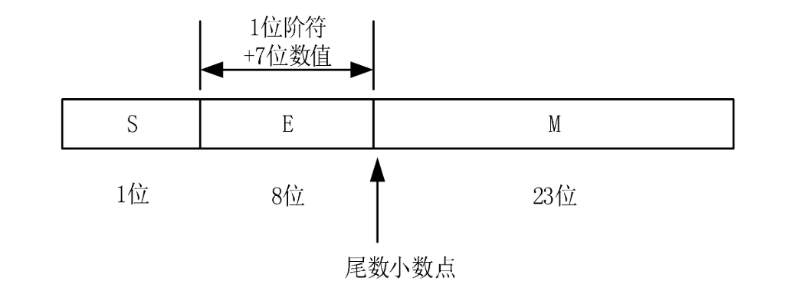

## 2.变量和类型

Rust的变量必须先声明后使用。 对于局部变量，最常见的声明语法为: 

```rust
let variable : i32 = 100;
```

局部变量声明一定 是以关键字 `let` 开头，类型一定是跟在冒号:的后面 。  如果我们可以通过上下文环境由编译器自动 分析出这个变量的类型 ，那么这个类型描述完全可以省略不写 。 

Rust 中声明变量缺省是“**只读**”的，比如如下程序: 

```rust
let x = 5;
x = 10;
```

会报错："cannot assign twice to immutable variable"

如果我们需要让变量是可写的，那么需要使用 mut 关键字：

```rust
let mut v1 = 1024;
v1 = 1025;
```

let 语句在此处引入了一个模式解构，我们不能把 `let mut`视为一个组合，而应该将 `mut x` 视为一个组合 。 

```rust
let (mut a, mut b) = (1, 2);
let Point { x: ref a, y: ref b } = p;
```

其中，赋值号左边的部分是一个“**模式**”，第一行代码是对 tuple 的模式解构，第二行代码是对结构体的**模式解构**。 所以，在 Rust中，一般把声明的局部变量并初始化的语句称为 “**变量绑定**”，强调的是“绑定”的含义，与 C/C++ 中的“赋值初始化”语句有所区别 。 

Rust中，每个变量必须被**合理初始化**之后才能被使用。 使用未初始化变量这样的错误，在 Rust中是不可能出现的 (利用unsafe做hack除外)。  

```rust
let x: i32;
println!("{}", x);//error: use of possibly uninitialized variable : 、X、
```

类型没有“默认构造函数”，变量没有“默认值” 。 对于 `let x: i32 ;` 如果没有显式赋值，它就没有被初始化 ，不要想当然地以为它的值是 0。 

Rust里的合法标识符(包括变量名、函数名、 trait名等) 必须由数字 、字母、下划线组成， 且不能 以数字开头 。 这个规定和许多现有的编程语言是一样的。

另外还有一 个 raw identifier功能，可以提供一个特殊语法， 如 `r#self`，让用户可以以关键字作为普通标识符。 这只是为了应付某些特殊情况时迫不得已的做法。    

### 2.1 变量遮蔽

Rust允许在同一个代码块中声明**同样名字**的变量。 如果这样做， 后面声明的变量会将前面声明的变量“遮蔽”( Shadowing)起来。 

```rust
		let x = "hello";
    println!("{}",x);
    let x ="bitcoin";
    println!("{}",x);
```

优势：

**变量遮蔽**在某些情况下非常有用，比如，我们需要在同一个函数内部把一个变量转换为另一个类型的变量，但又不想给它们起不同的名字。

再比如，在同一个函数内部，需要修改一个变量绑定的**可变性**。 例如，我们对一个可变数组执行初始化，希望此时它是可读写的， 但是初始化完成后，我们希望它是只读的。 可以这样做: 

```rust
		let mut v = Vec::new();// 可读写
    v.push(10);
    v.push(20);
    v.push(30);
    let v = v;// 只读
```

这个过程是符合“**内存安全**”的。 “内存安全”的概念一直是 Rust关注的重点。在上面这个示例中，我们需要理解的是，一个“**不可变绑定**” 依然是一个“**变量**” 。 虽然我们没办法通过这个“变量绑定”修改变量的值，但是我们重新使用“可变绑定”之后，还是有机会修改的。  

实际上，传统编程语言 C/C++ 中也存在类似的功能，只不过它们只允许嵌套的区域内部的变量出现遮蔽。 而 Rust在这方面放得稍微宽一点 ，同一个语句块内部声明的变量也可以发生遮蔽 。 

### 2.2 类型推导

Rust的类型推导功能是比较强大的。 它不仅可以从变量声明的当前语句中获取信息进行 推导，而且还能通过上下文信息进行推导。 

设置一个动态数组，并不知道数组内元素类型：


我们甚至还可以只写一部分类型 ， 剩下的部分让编译器去推导:

```rust
 let player_scores = [("Michael", 100), ("Iverson", 90)];
    // players是动态数组，内部成员的类型没有指定，交给编译器自动推导
    let players: Vec<_> = player_scores
        .iter()
        .map(|&(player, _score)| {
            player
        })
        .collect();
    println!("{:?}", players);
```

**自动类型推导**和“**动态类型系统**”是两码事。 Rust依然是**静态类型**的。 一个变量的类型 必须在**编译阶段**确定 ，且无法更改， 只是某些时候不需要在源码中显式写出来而已 。 这只是 编译器给我们提供的一个辅助工具。 

Rust只允许“**局部变量**/**全局变量**”实现类型推导，而 **函数签名**等场景下是**不允许**的 。

这样设计是有意图的：

这是因为局部变量只有局部的影响，全局变量必须**当场**初始化，而函数签名具有**全局性影响**。 函数签名如果使用自动类型推导，可能导致某个调用的地方使用方式发生变化，它的参数、 返回值类型就发生了变化， 进而导致远处另一个地方的编译错误，这是设计者不希望看到的情况 。 

### 2.3 类型别名

用 type关键字给同一个类型起个别名(type alias) ：

```rust
type Abc = u32;// Abc 就是u32的类型别名

fn func1(age: Abc, year: u32) -> Abc {
    age + year
}

fn main(){
    let x: Abc = 18;
    println!("{}", func1(x, 10));
}
```

类型别用还可以用在**泛型**场景：

```rust
type Double<T> = (T,Vec<T>)
```

那么以后使用 Double<i32>的时候， 就等同于 (i32, Vec<i32>) ，可以简化代码。 

### 2.4 静态变量

用 static关键字声明静态变量 。与 let 语句 一 样， static 语句同样也是一个**模式匹配** 。 

与 let 语句不同的是，用 static声明的变量的**生命周期**是整个程序，从启动到退出。  

static变量的生命周期永远是static ，它占用的内存空间也不会在执行过程中回收 。 这也是 Rust 中**唯一**的 **声明全局变量**的方法。 

#### 2.4.1 全局变量的限制

- 全局变量必须在声明时立刻初始化；
- 全局变量的初始化必须是编译期可确定的**常量**，不能包括执行期才能确定的表达式、语句和函数调用; 
- 带有 mut修饰的全局变量 ，在使用的时候必须使用 `unsafe` 关键字 
- 全局变量无法使用**自动匹配**，必须手动表明变量类型。


注：全局变量G1是只读。

全局变量名rust建议都用**大写**。

可变的全局变量无论读写都必须用unsafe修饰：


Rust禁止在声明 static 变量的 时候调用 普通函数，或者 利用语句块调用其他非 const代码: 

```rust
// 允许
static array: [i32; 3] = [1, 2, 3];
// 不允许
static vec:Vec<i32> = {let mut v = Vec::new();v.push(1);v};
```

调用const fn是允许的

```rust
// 因为 const fn 是编译期执行的 。目前还没有 stable，因此 需要使用 nightly 版本并打开 feature gate 才能使用 。
#![feature(const_fn)]
fn main() {
    use std::sync::atomic::AtomicBool;
    static FLAG: AtomicBool = AtomicBool::new(true);
}
```

Rust不允许用户在 main 函数之前或者之后执行自己的代码 。 所以，比较复杂的 static 变量的初始化一般需要使用 lazy方式 ， 在第一次使用的时候初始化。 

在Rust中 ， 如果用户需要使用比较复杂的全局变量初始化，推荐使用 `lazy_static`库。 

### 2.5 常量

在 Rust 中还可以用 const关键字做声明 ：

```rust
const G1: i32 = 1024;
```

使用 const 声明的是**常量** ，而不是变量。 因此**一定不允许**使用 `mut` 关键字修饰这个变量绑定。

常量的初始化表达式也一定要是一个**编译期常量** ，不能是运行期的值。

全局常量名推荐全部**大写**。  

#### 2.5.1 const与static的区别

编译器并不一定会给const常量分配内存空间， 在编译过程中，它很可能会被**内联优化** 。  

 因此，用户千万不要用` hack `的方式，通过 unsafe 代码去修改常量的值，这么做是没有意义的 。 以` const `声明一个常量，也**不具备**类似` let `语句的模式匹配功能（自动匹配） 。 

### 2.6 基本数据类型

#### 2.6.1 bool

```rust
		let x = true;
    let y: bool = !x;//取反运算
    let z = x && y;//逻辑与，带短路功能
    let z = x || y;//逻辑或，带短路功能
    let x = 1;
    let y = 2;
    let z = x & y;//按位与，不带短路功能
    println!("{}", z);
    let z = x | y;//按位与，不带短路功能
    println!("{}", z);
    let z = x ^ y;//按位异或，不带短路功能
    println!("{}", z);
```

#### 2.6.2 char

字符类型由 char表示。 它可以描述任何一个符合 **unicode标准**的字符值。 在代码中， 单个的字符字面量用**单引号**包围 。 

```rust
		let c1 = '\n'; // 换行符
    let c2 = '\x7f';    // 8 bit 字符变量
    let c3 = '\u{FFFF}';    // unicode字符
```

因为 char类型的设计目的是描述任意一个 unicode 字符，因此它占据的内存空间不是 1 个字节， 而是**4个字节**。 

对于 **ASCII字符**其实只需占用**一个字节**的空间，因此 Rust提供了单字节字符字面量来 表示 ASCII字符。 我们可以使用一个字母 `b`在字符或者**字符串**前面，代表这个字面量存储在**u8 类型数组**中，这样占用空间比 char 型数组要小一些 。 


#### 2.6.3 整数类型

各种整数类型之间的 主要区分特征 是: 有符号/无符号，占据空间大小 。 


Rust原生支持了从 8 位到 128 位的整数 。 

 需要特别关注的是 isize 和 usize 类型 ：

它们占据的空间是不定的，与**指针**占据的空间一致，与所在的平台相关 。 如果是 32 位系统上，则是 32 位大小; 如果是64位系统上，则是64位大小。  


Rust 的这一策略与 C 语言不同， C 语言标准中对许多类型的大小并没有做强制规定，比如 int、 long、 double 等类型，在**不同平台**上都可能是不同的大小，这给许多程序员带来了不必要的麻烦 。 相反，在语言标准中规定好各个类型的大小，让**编译器**针对不同平台做适配，生成不同的代码，是更合理的选择 。 

```rust
		let var1 =32;// 十进制
    let var2 =0xff;// 0x开头表示十六进制
    let var3 =0o77;// 0o开头表示八进制。在 C/C++/JavaScript语言中以0开头的数字代表八进制坑过不少人，Rust设计不一样
    let var4 =0b1001;// 0b开头表示二进制
```

在所有的数字**字面量**中，可以在任意地方添加任意的下划线，以方便阅读: 

```rust
    let var5 =0x_1234_abcd;// 使用下划线分割数字，不影响语义，提升阅读体验
```

字面量后面可以跟后缀，可代表该数字的具体类型，从而省略掉**显示类型标记** : 


在 Rust 中，我们可以为**任何一个类型**添加方法，**整型**也不例外 。 比如在标准库中，整数 类型有一个方法是 pow，它可以计算 n次幕，于是我们可以这么使用 : 

```rust
		let x: i32 = 2; // 当let x =2;这样初始化的时候，是无法使用pow方法的。一定要手动定义类型，才可以使用标准库中为各种类型实现的方法。
    println!("{}", x.pow(4));

// 甚至可以直接对整形字面量调用函数！
		println!("{}", 2_u8.pow(4));
```

对于整数类型，如果 Rust编译器通过上下文无法分析出该变量的具体类型， 则自动默认为**i32类型** 。

关于整数溢出：

在整数的算术运算中，有一个比较头疼的事情是“溢出” 。 在 C语言中，对于无符号类型，算术运算永远不会 overflow，如果超过表示范围，则自动舍弃高位数据 。 对于有符号类型，如果发生 了 overflow，标准规定这是 undefined behavior，也就是说随便怎么 处理都可以 。 

**未定义行为有利于编译器做一些更激进的性能优化**，但是这样的规定有 可能导致在程序员不知情的某些极端场景下， 产生诡异的 bug。 

Rust 的设计思路更倾向于**预防bug**， 而不是无条件地压榨效率。比如彻底杜绝“Segment Fault”这种内存错误是 Rust 的一个重要设计目标。  

举例子：

```rust
fn arithmetic(m:i8,n:i8){
    println!("{}",m+n)
}

fn main(){
    arithmetic(120,120)
}
```


```shell
# 编译debug版本，可通过
$ rustc main.rs
# 运行
$ ./main
# 报错：
# thread 'main' panicked at 'attempt to add with overflow', main.rs:113:19
# note: run with `RUST_BACKTRACE=1` environment variable to display a backtrace.
```

但是编译一个优化后的版本，加上-O选项：

```shell
$ rustc -O main.rs
./main
# 打印出 -16。执行时没有错误，而是使用了自动截断策略。
```

120_i8的二进制位01111000 --> 120_i8+120_i8为:01111000+01111000=11110000（计算机认为结果的补码是11110000）

将11110000从补码转为原码：**因为符号位为1，其余各位取反，整体加一**，即10001111+00000001=10010000 -> -16

##### 2.6.3.1 如何设置溢出检查功能

Rust编译器还提供了一个独立的编译开关供我们使用，通过这个开关，可以设置溢出时的处理策略: 

```shell
 $ rustc -C overflow-checks=no main.rs # 关闭溢出检查，但是它还是debug版本
```

如果在某些场景下，用户确实需要更精细地**自主控制**整数溢出的行为，可以调用标准库中的 checked\_\*、saturating\_\*和 wrapping_\*系列函数。 

```rust
let i = 100_i8;
println!("checked {:?}", i.checked_add(i));
println!("saturating {:?}",i.saturating_add(i));
println!("wrapping {:?}",i.wrapping_add(i));
```

checked_*系列函数返回的类型是 Option< >， 当出现溢出的时候，返回 值是`None`; 

saturating_*系列函数返回类型是整数， 如果溢出，则给出该类型可表示范 围的“最大/最小”值; 

 wrapping_*系列函数则是直接抛弃已经溢出的最高位，将剩下的部分返回 。 


在对**安全性**要求非常高的情况下，强烈建议用户尽量使用这几个方法**替代**默认的算术运算符来做数学运算，这样表意更清晰 。  

在 Rust标准库中就大量使用了这几个方法， 而不是简单地使用算术运算符，值得大家参考 。 

在很多情况下，整数溢出应该被处理为截断，即丢弃**最高位**。 

为了方便用户，标准库还提供了一个叫作 `std: :num: :Wrapping`的类型。 它重载了基本的运算符， 可以被当成普通整数使用。 凡是被它包裹起来的整数，任何时候出现溢出都是**截断行为**。 

```rust
use std::num::Wrapping;

fn main(){
  // 4294967295
    println!("{}",std::u32::MAX);
    let big = Wrapping(std::u32::MAX);
    let sum = big + Wrapping(2_u32);
  // 4294967295 + 2 截断后为1 
    println!("{}",sum);
}

```

不论用什么编译选项，上述代码都不会触发 panic，任何情况下执行结果都是一致的 。 

#### 2.6.4 浮点类型

按占据空间大小区分，分别为 f32 和 f64，其使用方法与整型差别不大。 浮点数字面量表示方式有如下几种: 

```rust
   println!("{}",sum.0);
   let f1 = 123.0f64;
   let f1 = 123.0_f64;
   let f2 = 0.1f32;
   let f2 = 0.1_f32;
   let f3 = 12e+99f64;
   let f3 = 12e+99_f64;
   let f4: f64 = 2.;
```

与整数类型相比， Rust 的浮点数类型相对**复杂**得多 。 浮点数的麻烦之处在于 : 它不仅可以表达正常的数值 ， 还可以表达不正常的数值 。 

##### 2.6.4.1 浮点数的表示

在IEEE754标准中，每个浮点数由三部分组成：符号位S、指数部分E和尾数部分M：


32位单精度浮点数如下：



S：0表示正，1表示负

E：指数，即阶码部分。其中包括1位阶符+7位数值。采用移127码，移码值为127。用于表示小数点在该数中的位置。

M：尾数共23位。由于尾数采用规格化表示，所以IEEE754标准约定小数点左边有一位隐含位1，从而使尾数的实际有效位为**24位**。，即尾数的有效值为1.M。

所以`N = (-1)^S * 1.M * 2^(E - 127)`

十进制中通常一个浮点数可以用科学技术法来表示，举例：-306.5可以表示为`-0.3065*10^3`。

其中 - 是符号，指数3是阶或称阶码，0.3065是小数部分  左右段非0包起来的部分是有效值——这里的有效值是3065，小数部分也称为尾数，显然3065也是尾数（-3.87的话 387是有效值 87是尾数）。

因为他可以表示为`-3.065*10^2` 也可以表示为`-0.03065*10^4` 等，小数部分可以左右“浮动” 。但不管小数部分怎么移动，他的有效值是不变的，都是3065 （不过尾数是变化的）。

规格化：

为了使**有效值**和**尾数**能够统一，在空间上表达更有效率有必要将所有浮点数规格化，即**浮点数通过调整阶码，写成小数点前不含有有效数字**，小数点后第一位由非0数字表示，举例-306.5规格化为`-0.3065*10^3 `。

二进制浮点数的规格化方法：

通过调整小数点的阶码使得该数的有效值在1和2之间，既二进制浮点数的整数部分为1，

例如：0.8125(十进制) = 0.1101（二进制） 规格化为->  1.101*2^(-1)

例如:

```
0.07525表示成二进制是：
0.07525*2=0.1505 0
0.1505*2=0.301 0
0.301*2=0.602 0
0.602*2=1.204 1
0.204*2=0.408 0
0.408*2=0.816 0
0.816*2=1.632 1
0.632*2=1.264 1
0.264*2=0.528 0
0.528*2=1.056 1 (这个步骤实际上就是在求尾数)
即二进制位为0.0001001101，对其进行规格化-> 1.001101*2^(-3)

由此，阶码=-3+127=124,二进制为01111100，尾数为001101,那么该浮点数的底层存储为 0 01111100 00110100000000000000000
```


#####2.6.4.2 rust的浮点数机制 

在标准库中，有一个`std::num::FpCategory` 枚举，表示了浮点数可能的状态: 

```rust
pub enum FpCategory {
    // "Not a Number", often obtained by dividing by zero.
    #[stable(feature = "rust1", since = "1.0.0")]
    Nan,

    // Positive or negative infinity.
    #[stable(feature = "rust1", since = "1.0.0")]
    Infinite,

    // Positive or negative zero.表示正常的0值
    #[stable(feature = "rust1", since = "1.0.0")]
    Zero,

    // De-normalized floating point representation (less precise than `Normal`).
    #[stable(feature = "rust1", since = "1.0.0")]
    Subnormal,

    // A regular floating point number.表示正常状态的浮点数
    #[stable(feature = "rust1", since = "1.0.0")]
    Normal,
}
```

浮点数的二进制表达方式: `x = (-1)^s * (1 + M) * 2^e`。 其中 s是**符号位**， M是**尾数**， e是**指数**。  

尾数：

尾数M是一个[0, I)范围内的**二进制表示的小数**。  

假设是32位浮点数，如果是normal形式，0表示为所有位数全 0，则**最小**的**非零正数**将是尾数最后一位为1的数字，就是 x1=`(1+2^(-23))*2^(-127)` ，而次小的数字为`x2 = (1+2^(-22))*2^(-127)`,这两个数字的差值为`2^(-23)*2^(-127)=2^(-150)` 。

以此推算，最小的数字和 0 之 间的差距有`(1+2^(-23))*2^(-127)`，约等于` 2^(一127)` 。也就是说，数字在渐渐减少到 0 的过程中突然降到了0。 


为了减少0与最小数字、最小数字与次小数字之间差距的突然下降，subnormal规定：

当指数位全0的时候，指数表示为-126 而不是-127 （也就是说指数最低位为1）。这样的情况下，浮点数的二进制表达方式变为`x = (-1)^s * M * 2^e`，不再是`x = (-1)^s * (1 + M) * 2^e` ，这样最小的**非零正数**就变成了 `2^(-23)*2^(-126)`，次小正数变为`2^(-22)*2^(-126)`，二者之差为`2^(-23)*2^(-126)`,最小正数与0只差也是`2^(-23)*2^(-126)`。浮点数在这种状态下就出于subnormal状态。

subnormal状态的浮点数可表示的精度比normal状态下的精度低一点，但是步长更均衡。

```rust
fn main() { 
    let mut s = std::f32::EPSILON; // 理解为一个非常小的f32的浮点数
    while s > 0.0 {
        s = s/2.0;
        println!("{} {:?}",s,s.classify());
    }
}
```

打印结果：

```
0.000000059604645 Normal
0.000000029802322 Normal
0.000000014901161 Normal
0.000000007450581 Normal
0.0000000037252903 Normal
0.0000000018626451 Normal
0.0000000009313226 Normal
0.0000000004656613 Normal
0.00000000023283064 Normal
0.00000000011641532 Normal
0.00000000005820766 Normal
0.00000000002910383 Normal
0.000000000014551915 Normal
0.000000000007275958 Normal
0.000000000003637979 Normal
0.0000000000018189894 Normal
0.0000000000009094947 Normal
0.00000000000045474735 Normal
0.00000000000022737368 Normal
0.00000000000011368684 Normal
0.00000000000005684342 Normal
0.00000000000002842171 Normal
0.000000000000014210855 Normal
0.0000000000000071054274 Normal
0.0000000000000035527137 Normal
0.0000000000000017763568 Normal
0.0000000000000008881784 Normal
0.0000000000000004440892 Normal
0.0000000000000002220446 Normal
0.0000000000000001110223 Normal
0.00000000000000005551115 Normal
0.000000000000000027755576 Normal
0.000000000000000013877788 Normal
0.000000000000000006938894 Normal
0.000000000000000003469447 Normal
0.0000000000000000017347235 Normal
0.00000000000000000086736174 Normal
0.00000000000000000043368087 Normal
0.00000000000000000021684043 Normal
0.00000000000000000010842022 Normal
0.00000000000000000005421011 Normal
0.000000000000000000027105054 Normal
0.000000000000000000013552527 Normal
0.0000000000000000000067762636 Normal
0.0000000000000000000033881318 Normal
0.0000000000000000000016940659 Normal
0.00000000000000000000084703295 Normal
0.00000000000000000000042351647 Normal
0.00000000000000000000021175824 Normal
0.00000000000000000000010587912 Normal
0.00000000000000000000005293956 Normal
0.00000000000000000000002646978 Normal
0.00000000000000000000001323489 Normal
0.000000000000000000000006617445 Normal
0.0000000000000000000000033087225 Normal
0.0000000000000000000000016543612 Normal
0.0000000000000000000000008271806 Normal
0.0000000000000000000000004135903 Normal
0.00000000000000000000000020679515 Normal
0.00000000000000000000000010339758 Normal
0.00000000000000000000000005169879 Normal
0.000000000000000000000000025849394 Normal
0.000000000000000000000000012924697 Normal
0.0000000000000000000000000064623485 Normal
0.0000000000000000000000000032311743 Normal
0.0000000000000000000000000016155871 Normal
0.0000000000000000000000000008077936 Normal
0.0000000000000000000000000004038968 Normal
0.0000000000000000000000000002019484 Normal
0.0000000000000000000000000001009742 Normal
0.0000000000000000000000000000504871 Normal
0.00000000000000000000000000002524355 Normal
0.000000000000000000000000000012621775 Normal
0.0000000000000000000000000000063108872 Normal
0.0000000000000000000000000000031554436 Normal
0.0000000000000000000000000000015777218 Normal
0.0000000000000000000000000000007888609 Normal
0.00000000000000000000000000000039443045 Normal
0.00000000000000000000000000000019721523 Normal
0.000000000000000000000000000000098607613 Normal
0.000000000000000000000000000000049303807 Normal
0.000000000000000000000000000000024651903 Normal
0.000000000000000000000000000000012325952 Normal
0.000000000000000000000000000000006162976 Normal
0.000000000000000000000000000000003081488 Normal
0.000000000000000000000000000000001540744 Normal
0.000000000000000000000000000000000770372 Normal
0.000000000000000000000000000000000385186 Normal
0.000000000000000000000000000000000192593 Normal
0.0000000000000000000000000000000000962965 Normal
0.00000000000000000000000000000000004814825 Normal
0.000000000000000000000000000000000024074124 Normal
0.000000000000000000000000000000000012037062 Normal
0.000000000000000000000000000000000006018531 Normal
0.0000000000000000000000000000000000030092655 Normal
0.0000000000000000000000000000000000015046328 Normal
0.0000000000000000000000000000000000007523164 Normal
0.0000000000000000000000000000000000003761582 Normal
0.0000000000000000000000000000000000001880791 Normal
0.00000000000000000000000000000000000009403955 Normal
0.000000000000000000000000000000000000047019774 Normal
0.000000000000000000000000000000000000023509887 Normal
0.000000000000000000000000000000000000011754944 Normal
0.000000000000000000000000000000000000005877472 Subnormal
0.000000000000000000000000000000000000002938736 Subnormal
0.000000000000000000000000000000000000001469368 Subnormal
0.000000000000000000000000000000000000000734684 Subnormal
0.000000000000000000000000000000000000000367342 Subnormal
0.000000000000000000000000000000000000000183671 Subnormal
0.000000000000000000000000000000000000000091835 Subnormal
0.000000000000000000000000000000000000000045918 Subnormal
0.000000000000000000000000000000000000000022959 Subnormal
0.00000000000000000000000000000000000000001148 Subnormal
0.00000000000000000000000000000000000000000574 Subnormal
0.00000000000000000000000000000000000000000287 Subnormal
0.000000000000000000000000000000000000000001435 Subnormal
0.000000000000000000000000000000000000000000717 Subnormal
0.000000000000000000000000000000000000000000359 Subnormal
0.00000000000000000000000000000000000000000018 Subnormal
0.00000000000000000000000000000000000000000009 Subnormal
0.000000000000000000000000000000000000000000045 Subnormal
0.000000000000000000000000000000000000000000022 Subnormal
0.000000000000000000000000000000000000000000011 Subnormal
0.000000000000000000000000000000000000000000006 Subnormal
0.000000000000000000000000000000000000000000003 Subnormal
0.000000000000000000000000000000000000000000001 Subnormal
0 Zero
```

由结果可以看出在二分的过程中，浮点数从Normal状态进入Subnormal状态最后归为0。

Infinite 和 Nan 是带来更多麻烦的特殊状态 。 Infinite 代表的是“无穷大”， Nan 代表的是“不是数字”( not a number)。 

看个例子：

```rust
let x = 1.0f32 / 0.0;
let y = 0.0f32 / 0.0;
println!("{}  {}", x, y); // 打印结果：inf  NaN
```

即：非 0数除以 0值，得到的是 **inf**。0除以0得到的是 **NaN**。 

对 inf 做一些数学运算的时候，它的结果可能与你期望的不一致 : 

```rust
let inf = std::f32::INFINITY;
println!("{} {} {}", inf * 0.0, 1.0 / inf, inf / inf) // NaN 0 NaN
```


NaN这个特殊值有个特殊的麻烦，主要问题还在于它不具备“全序”的特点。 

```rust
let nan = std::f32::NAN;
println!("{} {} {}", nan < nan, nan > nan, nan == nan) // false false false
```

这就很麻烦了，一个数字可以**不等于**自己。因为 NaN 的存在，浮点数是不具备“全序关 系”( total order)的 。  

#### 2.6.5 指针类型

无 GC 的编程语言， 如 C、 C++以及 Rust，对数据的组织操作有更多的**自由度**，具体表现为: 

- 同一个类型，某些时候可以指定它在栈上，某些时候可以指定它在堆上。内存分配方式可以取决于使用方式 ，与类型本身无关。
- 既可以直接访问数据 ，也可以通过指针间接访问数据 。 可以针对任何一个对象取得指向它的指针 。
- 既可以在复合数据类型中直接嵌入别的类型的实体 ， 也可以使用指针，间接指向别的类型。   
- 甚至可能在复合数据类型末尾嵌入不定长数据构造出不定长的复合数据类型 。 

Rust里面也有指针类型，而且不止一种：


在标准库中还有一种封装起来的可以当做指针使用的类型，叫“智能指针”：


#### 2.6.6 类型转换

Rust对不同类型之间的转换控制得非常严格 。 i8类型的变量是无法向i16类型的变量赋值：

```rust
let v1: i8 = 10;
let v2: i16 = v1;// 编译报错：error[E0308]: mismatched types
```

Rust提供了一个关键字as， 专门用于这样的类型转换: 

```rust
let v1: i8 = 10;
let v2: i16 = v1 as i16;
```

也就是说， Rust设计者希望在发生类型转换的时候不是偷偷摸摸进行的，而是**显式**地标记出来，防止隐藏的 bug。 虽然在许多时候会让代码显得不那么精简，但这也算是一种合理的折中 。 


as 关键字也不是随便可以用的，它只允许**编译器认为合理**的类型转换 。 任意类型转换是不允许的 : 

```rust
let a = "hello world";
let b = a as u64; // 编译错误：error[E0606]: casting `&str` as `u64` is invalid
```

有些时候， 甚至需要连续写多个 as 才能转成功，比如 &i32 类型就不能直接转换为 *mut i32 类型：

```rust
 let i = 32;
 let p = &i as *const i32 as *mut i32; // 先转*const i32， 再转*mut i32(先转到只读，再转到可读写)
 println!("{:p}", p);
```

as表达式允许的类型转换如下图所示：


如果需要更复杂的类型转换，一般是使用**标准库**的 From Into 等 trait 

#### 2.6.7 复合数据类型

##### 2.6.7.1 tuple

tuple指的是“元组”类型，它通过圆括号包含一组表达式构成。tuple 内的元素**没有名字**。 tuple 是把几个类型组合到 一起的最简单的方式 。 

```rust
let a = (1i32,false);
let b = ("hello",(1i32,2i32));
```

如果元组中只包含一个元素，应该在后面添加一个逗号，以区分括号表达式和元组 : 


访问元组内部元素有两种方法，一种是“模式匹配”( pattern destructuring)，另外一种是 “数字索引” : 

```rust
let p = (1i32, 2u32, 3u64);
let (a, b, c) = p;
let d = p.0;
let e = p.1;
let f = p.2;
println!("{} {} {} {} {} {}", a, b, c, d, e, f);// 1 2 3 1 2 3
```

元组内部也可以一个元素都没有 。 这个类型单独有一个名字， 叫 unit (单元类型): 


可以说， unit类型是 Rust 中**最简单的类型**之一， 也是占用空间**最小**的类型之一 。 **空元组**和**空结构体** `struct Foo;` 一样，都是占用 **0** 内存空间 。

```rust
println!("i8 size : {}",std::mem::size_of::<i8>());
println!("char size : {}",std::mem::size_of::<char>());
println!("'()' size : {}",std::mem::size_of::<()>());
// 输出：
// i8 size : 1
// char size : 4
// '()' size : 0
```

注：std: :mem: :size_of 函数可以计算一个类型所占用的内存空间。 

与 C++中的空类型不同， Rust 中存在实打实的 0 大小的类型 。 在 C++标准中，有明确的规定"Complete objects and member subobjects of class type shall have nonzero size. "

```c++
class Empty{};
Empty emp;
assert(sizeof(emp)!=0);
```

##### 2.6.7.2 struct

结构体(struct)与元组类似， 也可以把多个类型组合到一起，但是它的每个元素都有自己的名字：

```rust
struct Point {
    alice: i32,
    bob: u32    // 每个元素之间采用逗号分开，最后一逗号可以省略不写
}
```

类型依旧跟在冒号后面，但是不能使用**自动类型推导功能**，必须**显式指定** 。 struct类型的初始化语法类似于 json 的语法——“成员一冒号一值” 。

```rust
let s = Point { alice: 1, bob: 2 };// 必须要写成员变量名，不能像golang一样直接填写值
```

如果有局部变量名字和成员变量名字恰好一致，那么可以省略掉重复的冒号初始化: 

```rust
let alice = 1i32;
let bob = 2u32;
let s = Point { alice, bob }; // 等同于 Point { alice:alice , bob:bob };
println!("{} {}", s.alice, s.bob);
```

访问结构体内部的元素 ，也是使用“点” 加变量名的方式 。 当然，我们也可以使用“模 式匹配”功能: 

```rust
let p = Point { alice: 1, bob: 2 };
let Point { alice: a, bob: b } = p;
println!("{} {}", a, b);
// 在模式匹配的时候,如果新的变量名刚好和成员名字相同,可以使用简写方式
let Point { alice, bob } = p;
println!("{} {}", alice, bob);
```

Rust设计了一个**语法糖**，允许用一种简化的语法赋值使用另外一个 struct 的部分成员 。 比如: 

```rust
struct Point {
    alice: i32,
    bob: u32,
    cathy: i64,
}

// 可以使用 default() 函数初始化其他的元素(default的函数名可以自定义)
fn default() -> Point {
    Point { alice: 1, bob: 2, cathy: 3 }
}

fn main() {
  let p = Point { ..default() };
  println!("{} {} {}", p.alice, p.bob, p.cathy);// 输出：1 2 3
  let p = Point { alice: 10, ..default() };
  println!("{} {} {}", p.alice, p.bob, p.cathy)	// 输出：10 2 3
  let p = Point { alice: 10, bob: 20, ..default() };
  println!("{} {} {}", p.alice, p.bob, p.cathy) // 输出：10 20 3
}
```

注：`..expr` 这样的语法 ， 只能放在**初始化表达式**中 ， 所有成员的最后**最多只能有一个**。

与tuple类似 ， struct 内部成员也可以是空: 

```rust
// 三种定义方式，内部没有成员
struct Foo1;
struct Foo2();
struct Foo3 {}
```

##### 2.6.7.3 tuple struct

tuple struct也是一种数据类型，像tuple和struct的混合。区别：tuple struct 有名字，而它们的成员没有名字。

```rust
struct Worker(i32,u32,f32);
```

它可以被想象成这样的结构体：

```rust
struct Worker {
    0: i32,
    1: u32,
    2: f32,
}
```

有时候我们不需要特别关心结构体内部成员的名字， 可以采用这种语法 。 

 tuple、 struct、 struct tuple起的作用都是把几个不同类型的成员**打包组合**成一个类型 。 它们的区别:


它们除了在取名上有这些区别外，没有其他区别 。 它们有一致的**内存对齐**策略、一致的**占用空间**规则，也有类似的语法。 

```rust
// struct
struct S1{
    a:i32
}

// struct tuple
struct S2(i32);

fn main(){
  let s1 = S1 { a: 10 };
  let s2 = S2(10);	// 初始化 tuple struct
  let s3 = S2 { 0: 10 }; // 初始化 tuple struct
  println!("{} {} {}", s1.a, s2.0, s3.0) // 输出：10 10 10
}
```


tuple struct有一个特别有用的场景，那就是当它只包含**一个元素** 的时候，就是所谓的 newtype idiom。 因为它实际上让我们非常方便地在一个类型的基础上创建了一个新的类型。 

```rust
    struct Student(i32);
    fn f1(v: Student) {}
    fn f2(v: i32) {}
    let v: i32 = 0;
    f1(v); // 编译报错：error[E0308]: mismatched types。因为Student和i32是不同类型，函数调用参数不匹配。
    f2(v);	// 编译通过
```

使用 type alias (类型别名)实现，那么就可以编译通过了: 

```rust
    type I = i32;
    fn f1(v: I) {}
    fn f2(v: i32) {}

    let v: i32 = 10;
    f1(v);
    f2(v);
```

通过关键字 type，我们可以创建一个新的**类型名称**，但是这个类型不是全新的类型，而只是一个具体类型的**别名** 。 在编译器看来 ，这个别名与原先的具体类型是**一模一样**的 。  

而使用 tuple struct 做包装，则是创造了一个**全新的类型**，它跟被包装的类型不能发生**隐式类型转换**， 可以具有不同的方法 ，满足不同的trait，完全按需而定。 

#### 2.6.8 enum

如果说tuple、 struct、 tuple struct在 Rust 中代表的是多个类型的**“与”关系**，那么 enum 类型在 Rust 中代表的就是多个类型的**“或”关系** 。 

与 C/C++ 中的枚举相比， Rust 中的 enum要强大得多，它可以为每个成员指定附属的类型信息。 

```rust
enum Num{
    Int(i32),
    Float(f32),
}
```

Num的内部可能是一个i32型整数，或者是f32型浮点数。

Rust的enum中的每个元素的定义语法与struct的定义语法类似。 可以像空结构体一样， 不指定它的类型。也可以像 tuple struct一样，用圆括号加无名成员;还可以像正常结构体一 样，用大括号加带名字的成员 。 

用 enum 把这些类型包含到一起之后，就组成了一个**新的类型**。 要使用 enum，一般要用到“模式匹配” 。  

```rust
enum Num {
    Int(i32),
    Float(f32),
}

fn read_num(num: &Num) {
    match num {
        // 如果匹配到Num::Int这个成员，那么value的类型就是i32
        &Num::Int(value) => println!("i32 : {}", value),
        // 如果匹配到Num::Float这个成员，那么value的类型就是f32
        &Num::Float(value) => println!("f32 : {}", value),
    }
}

fn main(){
 	  let n: Num = Num::Float(100f32);
    read_num(&n); // 打印输出：f32 : 100
}
```

注：

Rust的 enum与 C/C++的 enum和 union都不一样。 它是一种更**安全**的类型，可以被称 为"tagged union"。 

如果从C语言的视角来实现上面rust的代码：

```c
#include <stdio.h>
#include <stdint.h>

struct Number {
  // 标记值
  enum {Int,Float} tag;
  union {
    int32_t int_v;
    float float_v;
  } value;
};

void read_num(struct Number * num) {
  switch(num->tag) {
    case Int:
      printf(...);
      break;
    case Float:
      printf(...);
      break;
    default:
      printf(...);
      break;
  }
}

int main(){
  // C程序员需要手动定义标记
  struct Number n ={tag:Int,value:{int_v:10}};
  read_num(&n);
  return 0;
}
```

Rust 的 enum类型的变量需要区分它里面的数据究竟是哪种变体，所以它包含了一个内 部的“ tag标记”来描述当前变量属于哪种类型 。这个标记是不需要程序员自己手动定义的，而C则需要程序员自己来保证标记和数据类型的匹配。


当然，上面Demo只是为了通俗地解释 Rust 的 enum 类型的基本工作原理，在实际中， enum 的内存布局未必是这个样子， 编译器有许多优化，可以保证语义正确的同时减少内存使用，并加快执行速度 。


看一下Rust enum的结构大小： 

```rust
    println!("{} {} {}", std::mem::size_of::<Num>(), std::mem::size_of::<i32>(), std::mem::size_of::<f32>());
// 8 4 4
```

按理来说Num中存储i32或者f32，这两个数据类型都是4 byte，理论上Num也应该是4 byte，怎么变成了8 byte？

答：多出来的4 byte 就是用于保存类型标记的 （程序员不可见）。那底层的tag可以是用u8的1 byte来做，为什么偏偏是4 byte？因为是为了**内存对齐**。

注：Rust里面也支持union类型（该类型与C语言完全一致。但在Rust里面， 读取它内部的值被认为是unsafe行为，一般情况下我们不使用这种类型 。 它存在的主要目的是为了方便与C语言进行交互 。


Rust中， enum和struct为内部成员创建了新的**名字空间** 。 如果要访问内部成员，可以使用`::`符号 。 

同时可以手动指定每个变体的标记值：

```rust
enum Test {
        Alice = 1,
        Bob,
    }

let e = Test::Bob as isize;
println!("{}", e);  // 2
```

##### 2.6.8.1 Option\<T\>

Rust标准库中有一个极其常用的 enum类型 Option\<T\>，定义如下：

```rust
enum Option<T> {
  None,
  Some(T),
}
```

由于过于常用，标准库已经将Option以及Some和None都加入到了Prelude中。不需要使用use声明就可以直接使用，表示“要么存在，要么不存在”，例：Option\<i32\>表示“可以是一个i32类型的值，或者没有任何值”。


Rust 的enum实际上是一 种代数类型系统( Algebraic Data Type, ADT)。其内部的variant（变体）只是一个名字而已，而我们却可以将这个名字作为类型构造器使用。

可以简单理解为变体名字可以当成一个函数使用：

```rust
let array = [1, 2, 3];
    // 迭代器 + map
let v: Vec<Option<&i32>> = array.iter().map(Some).collect();
println!("{:?}", v);
// [Some(1), Some(2), Some(3)]
```

证明enum变体名是函数：

```rust
let _:()=Some;
```

编译报错：


#### 2.6.9 类型递归定义

Rust中复合数据类型是允许**递归定义**，即struct里面嵌套同样的struct类型。

但是不允许直接嵌套：

```rust
struct Test {
    data: i32,
    r: Test,
}
```

编译报错：


为什么编译报错会是“has infinite size”? 因为编译器计算Test这个类型大小的时候：

伪代码：

```rust
size_of::<Test>() == 4 + size_of::<Test>()
```

一个递归式子，实数范围内无解。所以是infinite size。

解决方法：用指针间接引用

```rust
struct Test {
    data: i32,
    r: Box<Test>,
}
```

