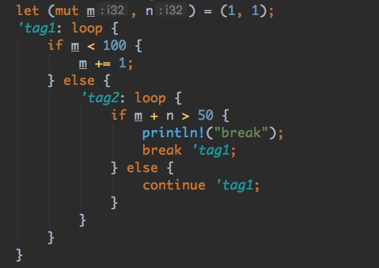

## 3.语句和表达式

Rust程序里，表达式（Expression）和语句（Statement）是完成流程控制、计算求值的主要工具。表达式可以是语句的一部分，反过来，语句也可以是表达式的一部分。

一个表达式总是会产生一个值，因此它必然有**类型** ; 语句不产生值，它的类型永远是 `( )`。 

如果把一个表达式加上**分号**，那么它就变成了一个语句; 如果把语句放到一个语句块中包起来 ， 那么它就可以被当成一个表达式使用 。


Rust 手册中这样说：

```
Rust is primarily an expression language.
```


“表达式”在 Rust程序中占据着重要位置，表达式的功能非常强大 。 Rust 中的表达式语法具有非常好的“一致性”，每种表达式都可以**嵌入**到另外一种表达式中，组成更强大的表达式。

Rust表达式又可以分为‘左值’ (lvalue）和‘右值’（rvalue）。

左值：该表达式可以表达一个内存地址。

因此，表达式可以放到赋值运算符左边使用。 其他的都是右值。

### 3.1 运算表达式

#### 3.1.1 算数运算符

Rust的算术运算符包括:加 （+）、 减（-）、 乘（*）、 除（/）、 求余（%）

x-y，x%y都是算是表达式，它们都有自己的值和类型。

#### 3.1.2 比较运算符

Rust的比较运算符包括: 等于（==）、不等于（!=）、 小于（<）、 大于（>）、 小于等于 （<=）、 大于等于（>=）。 

比较运算符的两边必须是同类型的，比较表达式类型是bool，禁止**连续比较**。

```rust
let (a, b, c) = (true, false, true);
if a==b==c { }
// 编译报错：error: aborting due to previous error
```

#### 3.1.3 位运算符


注意：Rust中按位取反是`!`，不是`~`

```rust
let n1: u8 = 0b_1111_0000;
let n2: u8 = 0b_0000_1111;
println!("{:08b}", n1 | n2);// 位运算表达式
// 11111111
```

#### 3.1.4 逻辑运算符


取反运算符`!`既支持“逻辑取反”也支持“按位取反”。表达式类型由被操作数类型决定：如果是bool就执行逻辑取反，如果是数字类型就执行按位取反。

逻辑与和逻辑或同样具备**短路功能**。

注意：bool类型支持“按位与”和“按位或”

```rust
println!("{} {}", true && false, true & false); // false false
println!("{} {}", true || false, true | false); // true true
```

Rust里面的运算符优先级与 C语言里面的运算符优先级设置是**不一样**的。不过这并不重要，碰到复杂一点的表达式尽量用小括号明确执行顺序，不要总想**秀**。

### 3.2 赋值表达式

`左值表达式 + 赋值运算符（=）+ 右值表达式`构成赋值表达式。

赋值表达式也有对应的类型和值 。 不是说赋值表达式左操作数或右操作数的类型和值，而是说**整个表达式**的类型和值 。 

```rust
let (n1, mut n2) = (1, 2);
let z = (n2 = n1);
println!("{:?}", z);
// ()
```

Rust规定，赋值表达式的类型为**unit**，即空的tuple( )。而C中赋值表达式的值应该为左值，这点存在不同。

Rust如此设置的理由：防止连续赋值

```rust
let (x:i32, mut y:i32, mut z:i32) = (1, 2, 3);
z = y = x;// 编译报错，因为unit和i32不匹配
```

C 语言允许连续赋值，但这个设计没有带来任何性能提升，反而在某些场景下给用户带来了代码不够清晰直观的麻烦。这点存在不同。


Rust也支持**组合赋值表达式**，+、-、*、/、%、&、 I、^、<<、>>这几个运算符可以和赋值运算符组合成赋值表达式。

即

```rust
x+=y;
x*=y;
```

注：Rust**不支持**++、--运算符，请使用+=1、-=1来代替。这点与C和Golang存在不同。

### 3.3 语句块表达式

Rust中，**语句块**也可以是表达式的一部分。

语句和表达式的区分方式是后面带不带分号`;`。 如果带了分号，意味着这是一条语句，它的类型是 `()`; 如果不带分号，它的类型就是表达式的类型。


这点也是与C语言的不同之处。

同理，在Rust函数中，我们也可以利用该特点写返回值：

```rust
fn func1() -> i32 {
    // ... 省略函数逻辑
    1024
}
```

最后一条表达式没有加分号，因此整个语句块的类型就变成了i32。刚好与函数的返回类型匹配。 

这种写法与`return 100;` 语句的效果是一样的，相较于return语句来说没有什么区别，但是更加简洁 。 特别是用在闭包closure中，这样写就方便轻量得多 。

### 3.4 if ... else ...

```rust
let x = 1;
    if x == 0 {
        println!("a");
    } else if x == 1 {
        println!("b");
    } else {
        println!("c");
    }
```

Rust的if-else结构还可以当表达式使用：

```rust
let x = 1;
let y = if x == 1 { 100 } else { 200 };
println!("{}", y) // 100
```

所以Rust中，没有必要专门设计像C/C++中的三元运算符`condition ? a : b`，通过现有设计可以轻松实现同样功能。

注：如果使用if ... else ... 作为表达式，那么if分支和else分支的类型必须一致，否则编译报错。

### 3.5 loop

Rust中，使用loop表示一个无限死循环。可以使用 continue 和 break控制执行流程 ，这两个关键字使用方式同C和Golang。

另外， break语句和 continue语句还可以在多重循环中选择跳出到哪一层的循环。



我们可以在 loop、while、for循环前面加上“生命周期标识符” 。 该标识符以**单引号**开头， 在内部的循环中可以使用 break语句选择跳出到哪一层 。

这点跟Golang相同，但是跟C不同。

loop结构也可以作为表达式的一部分：

```rust
let ret = loop { break 1; };
println!("{}", ret); // 1
```

在loop内部的break后面可以跟一个表达式，这个表达式就是最终的loop表达式的值。 如果一个loop永远不返回，那么它的类型就是“发散类型” 。


编译器可以判断出ret的类型是**发散类型**，而后面的打印语句是永远不会执行的死代码。编译提醒：

 

### 3.6 while

while语句是带条件判断的循环语句。也可以使用continue和break来控制循环流程。

```rust
let mut v = 0;
while v < 100 {
	v += 1
}
```

#### 3.6.1 loop{}与while true{}的区别

Rust之所以设计了loop语句，是因为Rust语言要做更多的静态分析。loop和while true语句在运行时没有什么区别，它们主要是会影响编译器内部的静态分析结果。 

举例：

```rust
let v;
loop {
	v = 1024;
	break;
};
println!("{}", v)
// 完全可以通过编译
// 因为编译器可以通过流程分析推理出 v=1024; 必然在 println! 之前执行过。
```

```rust
let v;
while true {
	v = 1024;
	break;
};
println!("{}", v)
// 无法通过编译
// 编译器会觉得 while语句的执行跟条件表达式在运行阶段的值有关，因此它不确定x是否一定会初始化
```

报错如下：


### 3.7 for

Rust中的for循环实际上是许多其他语言中的for-each循环（Golang的for ... range ...）。 Rust中没有类似C/C++的**三段式**for循环语句。 

```rust
let array=&[10,20,30];
for i in array{
	print!("{} ",i)
}
// 10 20 30
```

for循环的主要用处是利用**迭代器**对包含同样类型的多个元素的容器执行遍历，如数组 、 链表、 HashMap、 HashSet等 。 在Rust中 ， 我们可以轻松地定制自己的**容器**和**迭代器**，因此也很容易使for循环也支持**自定义类型**。

这种用法思想很像python的设计。

for循环内部也可以使用continue和break来控制流程。

