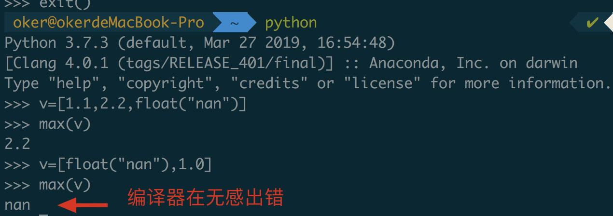
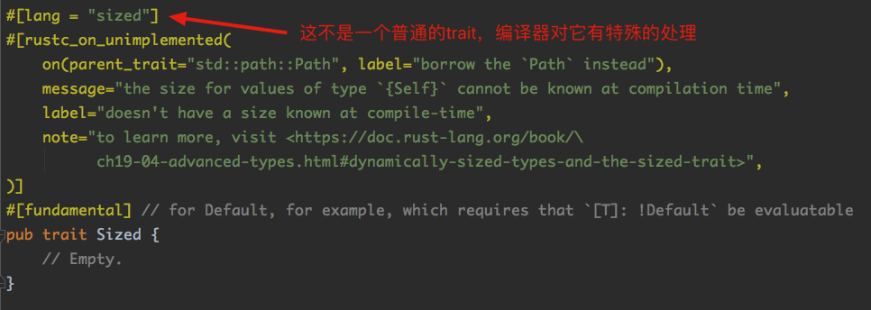
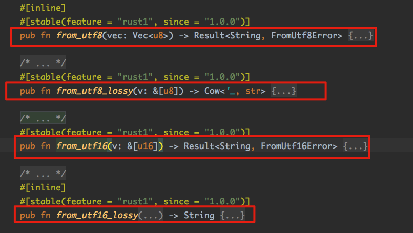
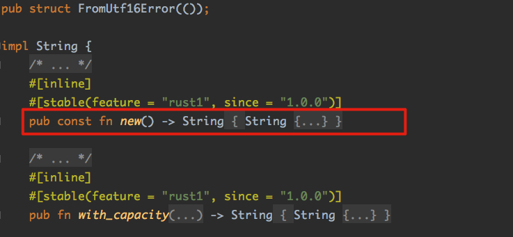

## 5.trait

Rust中trait属于非常重要一环，承担多种职责。trait中可以包含：函数、常量、类型等。

看个简单的例子：

```rust
trait Coder {
    fn getSalary(&self) -> f64;
}
```

所有的trait中都有一个隐藏的类型**Self**——S大写，代表实现了此trait的具体类型。

trait中定义的函数，也可以称作**关联函数**( associated function)。关联函数第一个参数如果是Self相关类型，且命名为self——s小写。该参数可以被称为“receiver”(接收者)——这个概念golang中也有，用于定义类方法。

```go
type Student struct {
  Name string
}

func (s Student) GetName() string{
  return s.Name
}
```

### 5.1 成员方法

具有receiver参数的函数被称为“方法”（method），可以用`变量实例+小数点.`来调用；没有receiver参数的函数被称为“静态函数”（static function），可以用`类型+双冒号::`来调用。

注：Rust中，函数和方法是没有本质区别的。

Self (大写 S)和 self (小写 s)都是关键字。Self是**类型名**，self是**变量名**，一定要区分好。

self参数（小写s）同样也可以指定类型，但是该类型有限制——必须是**包装在Self类型之上的类型**。

对于第一个self参数，常见类型有：

- self:Self
- self:&Self
- self:&mut Self

Rust对此提供了一种简化写法，可以依次简写为:

- self
- &self
- &mut self

提醒：self参数只能用在第一个参数位置上，且“变量self”和“类型Self”的大小写不同。举个例子：

```rust
// 以下这两种写法，实际上完全是一样的
trait Test {
    fn method1(self: Self);
    fn method2(self: &Self);
    fn method3(self: &mut Self);
}

trait Test {
    fn method1(self);
    fn method2(&self);
    fn method3(&mut self);
}
```

这样最前面的例子：

```rust
trait Coder {
    fn getSalary(&self) -> f64;
}
// 就可以看成
trait Coder {
    fn getSalary(self:&Self) -> f64;
}
```

我们可以为某些具体类型**实现**（impl）这个trait：

```rust
fn main() {
    let coder = RustCoder { salary: 1024f64 };
    // 因为getSalary方法的第一个参数名是self，可以用.调用
    println!("{}", coder.get_salary());
}

struct RustCoder {
    salary: f64,
}

// impl为关键字
impl Coder for RustCoder {
    // Self类型 -> RustCoder ; self的类型 -> &Self -> &Rustcoder
    fn get_salary(&self) -> f64 { self.salary * 0.8_f64 }
}

trait Coder {
    fn get_salary(self: &Self) -> f64;
}

```

注：Rust中推崇**蛇形命名法**，这同C/C++，但与Golang正好相反（Golang推崇**匈牙利驼峰命名法**）

这个例子中，trait Coder就好像是Java和Golang中的Interface，在方法内部，可以通过self.salary的方式来访问类型的内部成员，这点跟python的类设计如出一辙。

对于一个类型，我们可以直接对它 impl 来增加成员方法，而无须加 trait的名字：

```rust
// 这地方跟trait Coder已经没关系了
impl RustCoder {
    fn get_salary(&self) -> f64 { self.salary * 0.8f64 }
}
```

这段代码可以看做是RustCoder类型impl了一个匿名trait，被这样定义的方法叫做这个类型的“内在方法”（inherent methods）。

trait 中可以包含方法的**默认实现** 。 如果这个方法在trait中已经有了方法体，那么在针对具体类型实现的时候，就可以选择不用**重写** 。

当然，如果不想使用trait中的默认实现，可以选择“override”默认实现。比如：标准库中的trait——Iterator包含十多个方法，但只有` fn next(&mut self) -> Option<Self::Item> `是没有默认实现的。这样在实现迭代器的时候只需要挑选需要重写的方法来实现即可。

self 参数甚至可以是Box指针类型，即self : Box\<Self\>:

```rust
fn main() {
    let coder = RustCoder { salary: 1024f64 };
    println!("{}", coder.get_salary());
  // 编译出错：'get_salary' method not found in `RustCoder`
    let coder = Box::new(RustCoder { salary: 1024f64 });
    println!("{}", coder.get_salary());
  // 成功编译

}

struct RustCoder {
    salary: f64,
}

impl Coder for RustCoder {
    // Self类型 -> RustCoder ; self的类型 -> Box<Self> -> Box<Rustcoder>
    fn get_salary(self: Box<Self>) -> f64 { self.salary * 0.8_f64 }
}

trait Coder {
    fn get_salary(self: Box<Self>) -> f64;
}

```

 impl trait的对象不光只可以是struct，trait也可以实现trait:

```rust
fn main() {
    let coder = RustCoder { salary: 1024f64 };
    println!("{}", coder.cal_salary());
  	// 上面编译报错
    let coder = Box::new(RustCoder { salary: 1024f64 }) as Box<Getter>;// 进行了一次显式的类型转换，特意构建了一个Getter的trait object
    println!("{}", coder.cal_salary());
  	// 通过编译
}

trait Coder {
    fn cal_salary(&self) -> f64;
}

trait Getter {
    fn get_salary(&self) -> f64;
}

struct RustCoder {
    salary: f64,
}

// impl trait的是trait
impl Getter for RustCoder {
    fn get_salary(&self) -> f64 {
        self.salary
    }
}
// 由于Getter实现了Coder，那么实现Getter的对象就可以调用Coder中的关联函数
impl Coder for Getter {
    fn cal_salary(&self) -> f64 { self.get_salary() * 0.8f64 }
}
```

注意：`impl Coder for Getter`和`impl<T:Getter> Coder for T`是不一样的。

`impl Coder for Getter`中 self的类型是`&Getter`，它是一个trait object（一个**胖指针**）；

`impl<T:Getter> Coder for T`中self的类型是&T——是具体类型。

`impl Coder for Getter`是为trait object增添了一个成员方法，而`impl<T:Getter> Coder for T`是为所有的满足`T:Getter`的具体类型增加了一个成员方法。

所以上面的例子中，我们必须构造一个trait object之后才能调用cal_salary()成员方法。（即main方法中的显式类型转换）。


如果想不要特意实现一个trait object，就使用`impl<T:Getter> Coder for T`写法：

```rust
fn main() {
  	// 这个地方没有做显式类型转换
    let coder = Box::new(RustCoder { salary: 1024f64 });
    println!("{}", coder.cal_salary());
  	// 通过编译
}

trait Coder {
    fn cal_salary(&self) -> f64;
}

trait Getter {
    fn get_salary(&self) -> f64;
}

struct RustCoder {
    salary: f64,
}

impl Getter for RustCoder {
    fn get_salary(&self) -> f64 {
        self.salary
    }
}
// 只要实现了trait Getter的对象都可以直接调用Coder中的关联函数
impl<T: Getter> Coder for T {
    fn cal_salary(&self) -> f64 {
        self.get_salary() * 0.8f64
    }
}

```

ps：`impl Coder for Getter`这种写法很让初学者头晕，Getter既是trait又是type。现在会有warning要求：trait object的语法需要加上 dyn关键字。

```rust
fn main(){
  ...
      let coder = Box::new(RustCoder { salary: 1024f64 }) as Box<dyn Getter>;
  ...
}

...

impl Coder for dyn Getter {
    fn cal_salary(&self) -> f64 { self.get_salary() * 0.8f64 }
}
```

### 5.2 静态方法

第一个参数不是self参数的方法（没有receiver）称作“静态方法”。

静态方法调用：`type名::方法名`。

注意：即使第一参数是Self相关类型，只要形参的变量名字不是self，那就不能使用小数点的语法去调用。

```rust
fn main() {
    let x = S(1024);
  // 静态方法的调用时不需要对象实体的，这个跟Java很像。
    S::func(&x);
}

// 一个struct tuple
struct S(i32);

impl S {
    // 静态方法，尽管第一参数类型是Self，但是形参名称不是self
    fn func(this: &Self) {
        println!("{}", this.0);
    }
}
```

trait中也可以定义静态函数。看一下标准库中`std::default::Default`:

```rust
pub trait Default: Sized {
  ...
    fn default() -> Self;
}
```

注意这个default()函数，无参，返回值是实现该trait的具体类型——Self。

Rust中是没有“构造函数”的概念，这与C++与Java又成了对立面。

Default trait实际上可以看做是一个针对无参数构造函数的统一抽象：任何实现了Default trait的类型，可以静态方法default()得到一个该类型的对象——类似构造函数的功能。

同C++相比，Rust定义静态函数时没必要使用关键字static，因为它将self参数**显式地**在参数列表中列出来了。

而C++的成员方法默认可以访问**this指针**，因此它需要用static关键字来标记静态方法。

Rust不采取C++的设计的原因：主要是self参数的类型变化多端，不同写法语义差别很大。显式声明self可以更方便指定它这个self参数的类型。

### 5.3 扩展方法

Rust还可以利用trait给其他的类型增添成员方法，即使这个类型不是我们写的。

```rust
fn main() {
    let x: i32 = 2.triple();
    println!("{}", x)
}

trait T {
    fn triple(&self) -> Self;
}

// 给i32添加一个方法triple
impl T for i32 {
    fn triple(&self) -> Self {
        *self * 3
    }
}
```

Rust对上述操作有一个规定：

在声明trait和impl trait的时候，有一个一致性规则——Orphan Rule（孤儿规则）：**impl块要么与trait的声明在同一个的crate中，要么与类型的声明在同一个crate中**。

什么意思呢？

如果trait来自于外部crate，而且类型也来自于外部crate，编译器不允许你为这个类型impl这个 trait。也就是说trait和类型至少有一个是在当前crate中定义的。

举个例子：我引用了外部库a和b，a中声明了一个trait T，b中声明了一个struct S，我是不能在自己的程序中针对S实现T。

这意味着什么呢？

这意味着：上游开发者在给别人写库的时候，尤其要注意，一些比较常见的标准库中的trait，如 Display/Debug/ToString/Default等，应该尽可能地提供好。 否则，使用这个库的下游开发者是没办法帮他们把这些trait实现的 。

同理，如果是**匿名impl**，那么这个impl块必须与类型本身存在于同一个crate中 。

#### 5.3.1 trait与Interface的不同

往往一些其他语言的老程序员会用自带GC的语言中的“Interface”、抽象基类来理解trait这个概念。其实它们之间存在很大不同。

Rust是一种**用户可以对内存有精确控制能力的强类型语言**。 我们可以自由指定一个变量是在栈里面，还是在堆里面。变量和指针也是不同的类型 。 类型是有大小（Size）的 。 有些类型的大小是在编译阶段可以确定的，有些类型的大小是编译阶段无法确定的 。 

Rust规定：在函数参数传递、返回值传递等地方，都要求这个类型在**编译阶段**有**确定的大小**。否则编译器就不知道该如何生成代码。

而trait本身既不是**具体类型**，也不是**指针类型**，它只是定义了针对类型的、抽象的“约束” 。 不同的类型可以实现同一个trait，**满足同一个trait的类型可能具有不同的大小** 。 因此，trait在编译阶段**没有**固定大小，目前我们不能直接使用trait作为**实例变量**、**参数**、**返回值**。

所以这个跟其他语言的Interface就出现了很大的不同。看一下一些关于trait的错误写法：

```rust
fn main() {
    // trait T 不能做局部变量的类型
    let x: T = S { field: 1024 };
    // trait T 不能直接做参数类型
    fn use_T(arg: T) {}
    // trait T 不能直接做返回值类型
    fn ret_T() -> T {}
}

trait T {
    fn func(&self) -> i32;
}

struct S {
    field: i32,
}

impl T for S {
    fn func(&self) -> i32 {
        self.field
    }
}
```

务必记住：trait的大小在编译阶段是**不固定**的！后面说泛型的时候，再来解决这个地方留下的问题。

### 5.4 完整函数调用语法

看下面：

```rust
fn main() {
    let b = Baby;
  // 将要打印什么？
    b.run();
}

trait Sleep {
    fn run(&self);
}

trait Eat {
    fn run(&self);
}

struct Baby;

impl Sleep for Baby {
    fn run(&self) { println!("run:Sleep") }
}

impl Eat for Baby {
    fn run(&self) { println!("run:Eat") }
}
```

上面定义了两个trait，它们的run()函数有同样**方法签名** 。如果一个类型同时实现了这两个trait， 那么如果我们使用 variable.run() 这样的语法执行方法调用的话，就会出现歧义，编译报错："error[E0034]: multiple applicable items in scope"。

这时候，必须使用**完整的函数调用语法**来进行方法调用。只有这样写，才能清晰明白且无歧义地表达清楚期望调用的是哪个函数 :

```rust
 		let b = Baby;
    // 函数名字使用更完整的path来指定
    // self参数需要显式传递
    <dyn Sleep>::run(&b);
    <Baby as Eat>::run(&b);
```

具体写法：它的具体写法为 `<T as TraitName>::item`。

#### 5.4.1 成员方法与静态方法有区别么？

成员方法确实没有什么特别之处，它跟普通的静态方法唯一的区别就是：第一个参数名是self，而这个self只是一个普通的函数参数而已。

但是成员方法可以通过`小数点.`的方式调用。这样的调用方式，更从外观上更符合面向对象编程的思想，简单美观，完全可以视为一种**语法糖**。

需要注意的是，通过小数点语法调用时，有一个底层隐藏着的“取引用”的步骤。举例：

```rust
object.method()
```

一个简单的小数点调用，真正传给method()方法的参数时&object而不是object。这一步是编译器自动帮我们做的。不论在这个方法定义时设定的接受者self的类型究竟是Self、&Self还是&mut Self，最终我们都可以写成 `变量.method()`这种形式。

小Demo验证成员方法与普通函数无区别：

```rust
fn main() {
    check(T::method1);
    check(method2);
  	// 编译通过
}

struct T(usize);

impl T {
  // 成员方法
    fn method1(&self) -> usize { self.0 }
}
// 普通方法
fn method2(t: &T) -> usize { t.0 }

fn check(_: fn(&T) -> usize) {}
```

通过编译，表明成员方法method1和普通方法method2在底层都可以**隐性转换**成`fn(&T) -> usize`类型。

### 5.5 trait的约束

trait的另一大用处就是作为**泛型约束**使用。

泛型约束小例子：

```rust
use std::fmt::Debug;

fn main() {
    display("michael");
    display(1024i64);
    display(1.024f64);
    display(['b', 't', 'c']);
}

fn display<T: Debug>(x: T) {
    println!("my display : {:?}.", x);
}
// 输出结果：
// my display : "michael".
// my display : 1024.
// my display : 1.024.
// my display : ['b', 't', 'c'].
```

display函数引入了一个**泛型参数**T。这意味着display的参数不是一个具体类型，而是**一组类型**。

`<T:Debug>`冒号后面的Debug实际是trait的名字，其就是这个泛型参数的约束条件。它要求这个泛型参数T必须实现Debug这个trait。因为我在display的函数体内用到了`println!`格式化打印且用到了`{:?}`这样的格式控制符。如果不满足Debug的约束是编译不过去的。

所以，泛型约束既是对**实现部分**的约束（作为实参，你必须实现xxx的trait），也是对**调用部分**的约束（在函数体里，你如果想要调用约束trait以外其他trait的内敛方法也不好使）。

泛型约束还有一种写法，即where字句：

```rust
fn display<T>(x: T) where T: Debug {
    println!("my display : {:?}.", x);
}
```

提醒：简单情况，这两种写法都可以。但是在某些复杂情况，泛型约束只有where子句可以表达，直接用冒号的写法是表达不出来的——比如涉及到关联类型的时候。

#### 5.5.1 泛型约束解决了trait传参的问题

因为trait不可以作为参数的类型，那么如果要像别的语言一样传递一个接口实现类作为参数，就可以用泛型约束解决。

同golang相比，如果有两个接口interface1和interface2，我想传递一个参数类型，该类型既实现了interface1也实现interface2。我只能新建一个interface3，让它继承interface1和interface2，最后interface3作为参数。

但是rust里面不需要。

### 5.6 trait的继承

trait允许继承，例如：

```rust
trait Father {...}

trait Son: Father {...}
```

这表达的意思是：满足Son的类型，必然也满足Father。所以，在针对一个具体类型impl Son的时候，编译器也会要求该类型同时impl Father。

在编译器视角里，`trait Son:Father{}`等同于`trait Son where Self:Father{}`，等于给Son这个trait加了一个约束条件，即实现Son的具体类型必须满足Father trait的**约束**。

rust要求继承的trait必须分别实现：

```rust
struct T;

trait Father {
    fn method1();
}

trait Son:  {
    fn method2();
}
// T要分别实现Father和Son
impl Father for T {
    fn method1() {}
}

impl Son for T {
    fn method2() {}
}

// 这样直接在Son中实现所有Father和Son的方法会编译报错
impl Son for T {
    fn method1() {}
    fn method2() {}
}
```

### 5.7 Derive

Rust中为类型impl某些trait的时候，逻辑是非常机械化的。很多类型需要重复而单调地impl某些trait。为此，Rust提供了一个特殊的属性，它可以为我们自动impl某些trait。

```rust
struct S {
    data: i32
}

fn main() {
    let v1 = S { data: 0 };
    println!("{:?}", v1);
}
// 编译会报错："error[E0277]: `S` doesn't implement `std::fmt::Debug`"
```

因为我们自定义的S类型没有实现Debug的trait。除了手动实现外，可以加入这样一句话：

```rust
// 加入 derive
#[derive(Copy, Clone, Default, Debug, Ord, PartialOrd, PartialEq, Hash, Eq)]
struct S {
    data: i32
}

fn main() {
    let v1 = S { data: 0 };
    println!("{:?}", v1);
}
```

`#[derive(...)]`括号里面加入你想impl的trait名。这样编译器就会自动帮你加上impl块，类似：

```rust
impl Copy for S {...}

impl Clone for S {...}

impl Default for S {...}

impl Debug for S {...}

impl Ord for S {...}

impl PartialOrd for S {...}
...
```

注：这些trait都是标准库内比较**特殊的trait**，他们其中大部分包含有成员方法。但是成员方法的逻辑有一个统一的“**模板**”可以使用，编译器就机械化地重复执行这个模板。

目前Rust中可以自动derive的trait如下：

- Debug
- Clone
- Copy
- Hash
- RustcEncodable
- RustcDecodable
- PartialEq
- Eq
- ParialOrd
- Ord
- Default
- FromPrimitive
- Send
- Sync

### 5.8 trait别名

与type alias类似，trait也可以起别名——trait alias。

看一下例子：

```rust
pub trait Service {
    type Request;
    type Response;
    type Error;
    type Future: Future<Item=Self::Response, Eoor=Self::Error>;
    fn call(&self,req:Self::Request) -> Self::Future;
}
```

一个trait中的定义了很多类型，所有的成员方法使用的参数类型都是trait中自己定义的。

这样我们每次在实现或是使用该trait时候，都需要写：

```rust
Service < Request = http::Request, Response = http::Response, Error = http::Error >;
```

可以定义别名来避免麻烦：

```rust
trait HttpService = Service<Request=http::Request, Response=http::Response, Error=http::Error>;
```

### 5.9 标准库常用trait普及

#### 5.9.1 Display/Debug

它们主要用处就是用在`println!`这样的地方（类似golang中的类方法func(*) String() string）:

看个例子：

```rust
use std::fmt::{Display, Formatter, Error};

#[derive(Debug)]
struct S {
    alice: i32,
    bob: i32,
}

impl Display for S {
    fn fmt(&self, f: &mut Formatter) -> Result<(), Error> {
        write!(f, "{{ Kobe:{}, Jordan:{} }}", self.alice, self.bob)
    }
}

fn main() {
    let s = S { alice: 1, bob: 2 };
    println!("{}", s);
    println!("{:?}", s);
    println!("{:#?}", s);
}

// 输出结果：
// 正常打印（实现Display trait）
{ kobe:1, iverson:2 }
// 格式化打印（实现Debug trait）
S { alice: 1, bob: 2 }
S {
    alice: 1,
    bob: 2,
}
```

牢记：

- 只有实现了Display trait的类型，才可用`{}`格式控制打印出来；
- 只有实现了Debug trait的类型，才能用`{:?}``{:#?}`格式控制打印出来；

一些注意事项：

1. 实现Display，是假定了这个类型可以用utf-8格式的字符串表示。它是最终展示给用户看的，并不是所有类型都应该或者能够实现这个trait。所以，这个格式化完全取决于程序员自己，编译器**不提供**自动derive的功能。（编译器提供derive Debug trait，但是Display trait要我们自己写）；
2. 标准库中另一个重用trait`std::string::ToString`，对于所有实现了Display trait的类型，都自动实现了这个ToString trait——包含了一个`to_string(&self)-> String`方法。任何实现了Display trait的类型都可以直接调用该方法得到一个字符串。

**关于Debug trait的思考**：

该trait主要是为了调试使用，如果要写API，其中公开的类型一定要实现该Debug trait，以方便他人调试。

#### 5.9.2 PartialOrd/Ord/PartialEq/Eq

前面浮点数中提到：因为**Nan**的存在，rust的浮点数不具备**全序关系**。

那究竟什么是**全序**，什么是**偏序**？

Rust标准库中这样解释：

集合X中有元素a, b, c，

- 如果 a < b则一定有! (a > b)；反之， 若 a > b，则一定有 ! (a < b)，称为

  **反对称性** 。

- 如果a < b且b < c则a < c，称为**传递性**。

- 对于 X 中所有的元素，都存在 a < b或 a > b或者 a == b， 三者必居其一，称为**完全性** 。

- 如果集合中的元素只具备上述**前两条**特征，则称 X 是“偏序” 。 同时具备以上**所有**特征，则称 X 是“全序” 。

从定义得知，浮点数不具备全序特征（Nan不满足完全性），这导致一个很严重的问题：**浮点数无法排序**——无法得知`任意一个非Nan浮点数与Nan之间的大小关系`

```rust
    let nan = std::f32::NAN;
    let a = 1.024f32;
    println!("{}", nan < a);
    println!("{}", nan > a);
    println!("{}", nan == a);
// 输出结果（居然都是false）
false
false
false
```

对于该情况，Rust设计了两个trait：

- `std::cmp::PartialOrd`来表示**偏序关系**
- `std::cmp::Ord`来表示**全序关系**

看一下他们的对外接口定义：

```rust
// PartialOrd
pub trait PartialOrd<Rhs: ?Sized = Self>: PartialEq<Rhs> {
  // 返回值是 Option<Ordering> 
  fn partial_cmp(&self, other: &Rhs) -> Option<Ordering>;
    fn lt(&self, other: &Rhs) -> bool {...}
    fn le(&self, other: &Rhs) -> bool {...}
    fn gt(&self, other: &Rhs) -> bool {...} 
    fn ge(&self, other: &Rhs) -> bool {...}
}
// Ord
pub trait Ord: Eq + PartialOrd<Self> {
  // 返回值是一个确定的Ordering
    fn cmp(&self, other: &Self) -> Ordering;
}
```

上次分享时候说过：

```rust
enum Option<T> {
  None,
  Some(T),
} 
```

该枚举类型在标准库中极其常用，表示“要么存在，要么不存在”关系。

所以，`Option<Ordering>`表示的是一种不确定顺序关系。

注：

Rust中， f32和f64类型都只实现了PartialOrd，并没有实现Ord。

执行：

```rust
		let v1=[1_i64,2,99];
    let v2=[1f64,0.1,0.2];
    let maxInt = v1.iter().max();
    let maxFloat = v2.iter().max();
// 编译报错：error[E0277]: the trait bound `f64: std::cmp::Ord` is not satisfied
```

Rust中对**浮点数数组**求最大值是不可能的！

这恰恰是Rust的安全性优点：可能地在**编译阶段**发现错误， 而不是留到运行时再去报错。

看一下python：



Rust中的PartialOrd trait 从宏观上将就是C++20标准中即将加入的three-way comparison 运行符 `<=>`。

ParitalEq和Eq两个trait就是在半序和全序关系中对**相等的判定约束**，大致逻辑与排序关系类似。

#### 5.9.3 Sized

Sized是Rust中非常重要的一个trait，看一下它在标准库中的定义（std::marker模块）：



` [lang = ”sized”]`属性表明，这是个“内部关系户”。用户无权针对自己定义的类型impl这个trait。

也就是说：一个类型是否满足 Sized约束是完全由**编译器**推导的，用户无权指定。

众所周知，C/C++中，大部分变量、参数、返回值都应该是编译阶段固定大小。那么，等同到Rust中，只要在编译阶段就能确定大小的类型就都满足**Sized约束**。（这也是为什么声明go/c++等在声明原生数组的时候，必须用常量来表明数组大小的原因）

那还有什么类型是不满足Sized约束呢？

比如C语言的不定长数组，Rust中也有类似的类型`[T]` 。这种VLA（Variable-length Array）已经通过了RFC设计，但是暂时还没有实现。

不定长类型在使用的时候充满限制：不能作为函数的返回类型，必须将这个藏到指针背后才可以，等等...

Rust中对于动态大小类型专门有一个名词 Dynamic Sized Type。 后面将会看到的`[T]`,` str` 以及`dyn Trait`都是 DST。

#### 5.9.4 Default

Rust里面并没有C++/Java的“构造函数”，因为构造函数本身并没有提供什么额外的**抽象能力**。

 Rust推荐使用普通的**静态函数**作为类型的“构造函数” 

看一下标准库中提供的字符串类型String：



利用静态函数实现所谓的“构造函数”功能。这些方法接收的参数各异，错误处理方式也各异，强行将他们统一到同名字的构造函数中不是什么好想法。（这个设计与C++/Java的**函数重载**设计完全相反）

注意：Rust中坚决反对ad hoc式的函数重载。

那么对于那种无参数、无错误处理的情况，Rust标准库提供了Default trait来做统一的抽象：

```rust
trait Default {
	fn default() -> Self;	
}
```

标准库中很多类型都实现了这个trait。

#### 5.6.5 new不是关键字

很多类型中使用了new作为**函数名**，用于命名那种最常用的**创建新对象**的情况：



上图是标准库中String类的new函数。

因为这些new函数差别甚大，所以Rust并没有设计一个trait来对这些new函数做**统一抽象**。

### 5.10 总结

trait这个概念在Rust语言中扮演着非常重要的角色，承担了各式各样的功能。在开发中会经常用到。

如果有其他语言高级语言基础的，在初学时可以宏观上等同**interface**理解，但是其功能及特性要比interface强大更多。