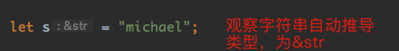
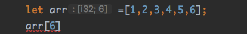
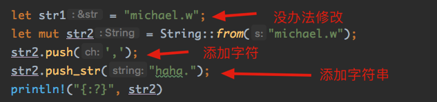

## 6. 数组与字符串

### 6.1 数组

数组是**容器**，在一块连续内存空间中，存储一系列**同样类型**的数据。

数组中元素占用空间大小必须是**编译期确定**的。数组本身存储的元素个数也必须是**编译期确定**的，且执行阶段不可变。

如需要使用动态变长容器，可以使用标准库中的`Vec/LinkedList`等。

数组类型的表示方式`[T;n]`，T代表元素类型，n代表元素个数（必须是编译期常量整数）。

```rust
    let array1: [i32; 5] = [1, 1, 1, 1, 1];
// 初始化同样的元素 -> [元素值；个数]
    let array2: [i32; 500] = [1024; 500];
```

#### 6.1.1 如何判断数组类型相同

Rust中，两个数组只有元素类型和个数完全相同，这两个数组才是同类型。

数组与指针之间**不能**隐式转换。（与C/C++和golang不同），同类型数组之间可以**相互赋值**。

```rust
		let (mut arr1, arr2) = ([1, 2, 3, 4, 5], [1024; 5]);
    arr1 = arr2;
    println!("{:?},{:?}", arr1, arr2);
// [1024, 1024, 1024, 1024, 1024],[1024, 1024, 1024, 1024, 1024]
```

#### 6.1.2 数组做函数参数

当把数组作为一个参数传给一个函数的时候，这个数组并**不会退化成一个指针**。而是会将这个数组**完整复制**进这个函数。这意味着函数体内对数组的改动是不会影响到函数外面的数组实体的。

#### 6.1.3 数组索引方式

中括号索引。Rust支持usize类型的索引的数组，索引从0开始。

```rust
		let arr = [1; 5];
    let sum = arr[0] + arr[1];
```

前面说过，`isize`和`usize`属于**整数类型**，其占据空间是不定的。与当前系统内**指针占据的空间**一致。

#### 6.1.4 内置方法

##### 6.1.4.1 数组比较

Rust可以直接实现数组的**比较**操作，只要它包含的元素是可以比较的:

```rust
		let (arr1, arr2) = ([1, 2, 2], [1, 2, 3]);
    println!("{}", arr1 < arr2); // true
```

只有相同类型的数组之间才可以进行比较（元素类型和元素个数相同）。

比较方式：从索引0开始，因此对比不同数组对应位置上的元素，出现的第一个**非等**比较关系为整个数组间的比较关系。

##### 6.1.4.2 数组的遍历

```rust
		let arr1 = [1, 2, 3, 4, 5, 6];
// 可以
    for i in &arr1 {
        println!("{}", i);
    }
// 可以
    for i in arr1.iter() {
        println!("{}", i);
    }
// Rust标准库中，数组本身没有实现IntoIterator trait, 所以不能使用数组本身来做for遍历。
    for i in arr1 {
        println!("{}", i);
    }
```

更多详情在后面的迭代器中会解释。

#### 6.1.5 多维数组

一个数组的元素T也是数组类型，所以`[ [T;m] ; n ]` 二维数组也是合法类型

```rust
    let arr: [[i32; 2]; 3] = [[0, 0], [1, 1], [2, 2]];
    for i in &arr {
        println!("{:?}", i);
    }
```

#### 6.1.6 数组切片

该“切片”与golang中的“切片”是完全不同的概念。

对数组对象取**借用borrow**操作，就可以生成一个“数组切片”。

数组切片对数组没有“所有权”。Rust中我们可以把数组切片看作**专门用于指向数组的指针**。是对数组的另外一个“视图”。

一个数组`[ T;n ]`，它的**借用指针类型**就是`& [ T;n ]`。它可以通过编译器转换为**数组切片**类型 `&[ T ]`

##### 6.1.6.1 数组切片的实质

Rust中，数组切片不是什么新类型，只是个**指针**。

它只不过是在编译阶段**丢弃了长度信息**的定长数组类型。它将这个长度信息存储为**运行期的值**。

```rust
		// 内部函数
		fn array(a: &mut [i32]) {
        a[2] = 5
    }

    println!("{:?}", std::mem::size_of::<[i32; 10]>()); // 40
    println!("{:?}", std::mem::size_of::<&[i32; 10]>()); // 8，一个正常指针大小
    println!("{:?}", std::mem::size_of::<&[i32]>()); // 16 ,

    let mut arr1: [i32; 10] = [1; 10];
    let arr2 = &mut arr1;
		// 实参arr2进入函数array的时候，类型由 &mut [ i32;10 ] 转换（魔法转换）为 &mut [i32] ，体积变成原来的两倍，即两个指针空间大小（16个字节）
    array(arr2);
    println!("{:?}", arr1);
```

#### 6.1.7 DST和胖指针

由前面可知，数组切片本质是指向一个数组的指针，但是它体积是普通指针的二倍——它不止包含了一个指针，还带有**长度信息**。

切片（Slice）与普通的指针不同，它有个很形象的名字：**胖指针**。

前面我也提过一个与之对应的概念——动态大小类型（Dynamic Sized Type, DST）。DST就是指**编译阶段无法确定占用空间大小**的类型。

为了安全性考虑，指向DST的指针一般都会是胖指针。

即，不定长数组类型`[ T ]`就有对应的胖指针 ` &[ T ]`；不定长字符串`str`类型就有对应的胖指针 `&str`



我们不能在栈上声明一个不定长的变量，所以不能用**不定长类型**做函数的**参数**和**返回值**。但是指向不定长数组的胖指针的大小是**确定的**，所以我们可以用胖指针来做变量实例、函数参数及返回值。

##### 6.1.7.1 胖指针里面到底包含了什么？

利用unsafe代码把胖指针内部的东西打印，一探究竟：

```rust
		fn raw_print(arr: &[i32]) {
        unsafe {
          // transmute函数是不安全的，所以需要用unsafe包起来。
          // 可以看作是一个强制类型转换，将胖指针转换成两个usize大小的整数
            let (v1, v2): (usize, usize) = std::mem::transmute(arr);
            println!("{:x} {:x}", v1, v2);
        }
    }

    let arr: [i32; 10] = [1; 10];
    let addr: &[i32; 10] = &arr;
    raw_print(addr)

// 打印： 7ffee8e47370 a(10的十六进制)
```

由此可见，胖指针包含了指向原数组的**地址**，以及该切片的**长度**。

##### 6.1.7.2 对于DST类型的限制

- 只能通过指针来间接地创建和操作DST类型(`&[ T ]`，`Box<[ T ]>`)，但是不可以用`[ T ]`；
- DST类型不能做**局部变量**和**函数参数**；
- enum中不能包含DST，struct中只有**最后一个**成员可以是DST类型；
- 如果struct包含了DST，那么该结构体也变成DST类型。

##### 6.1.7.3 为什么要设计胖指针？

既然作为函数参数传入DST时，编译器会做魔法转换，那么为什么还要特意设计出一个胖指针呢？

Rust这么设计，是为了避免数组类型作为参数传递时自动退化为裸指针（C/C++中的情况），这样会丢失长度信息。

#### 6.1.8 Range

对于这个词，大家应该不陌生吧！

Rust独有的特点：内置语法支持，就是两个小数点`..`

```rust
		let range = 1..8;
    for i in range {
        print!("{:?} ", i)
    }
// 打印： 1 2 3 4 5 6 7
```

注意：`a..b`这个语法中，左闭右开。这个同golang中的切片索引标定是一个标准。

`a..b`实际生成的是一个变量类型`std::ops::Range<_>`，标准库中定义：

```rust
pub struct Range<Idx> {
    /// The lower bound of the range (inclusive).
    #[stable(feature = "rust1", since = "1.0.0")]
    pub start: Idx,
    /// The upper bound of the range (exclusive).
    #[stable(feature = "rust1", since = "1.0.0")]
    pub end: Idx,
}
```

所以，`1..8`等同于：

```rust
use std::ops::Range;

fn main() {
    let r1 = Range { start: 1, end: 8 };
    let r2 = 1..8;
    println!("{:}", r1 == r2) // true
}
```

所以，`..`只是一个“语法糖”而已。

Range类型本身实现了Iterator trait，所以可以直接用for循环，可以调用迭代器的所有成员方法：

```rust
		use std::iter::Iterator;
// 0-9,倒序，*100
    let result = (0..10).rev().map(|a| a * 100);
    for i in result {
        print!("{:?} ", i)
    }
// 900 800 700 600 500 400 300 200 100 0
```

##### 6.1.8.1 其他几种Range

`start..` / `std::ops::RangeFrom`：只有起始没有结束的范围，含义[start,正无穷]

`..end`/ `std::ops::RangeTo` ：没有起始只有结束的范围。对于有符号数——(负无穷,end)，对于无符号数[0,end)

`..`/`std::ops::RangeFull`：没有上下限制的范围。对于有符号数——(负无穷,正无穷)，对于无符号数[0,正无穷)

##### 6.1.8.2 Range索引

个人认为，其就是同golang的arr[a:b]使用方法：

```rust
		let arr=[1,2,3,4,5,6,7,8,9];
    println!("{}",arr[2..5].len()); // 3
    println!("{:?}",arr[2..]); // 编译出错：想想为什么？Rust中的arr[2..]和Golang中arr[2:]一样么？
```

报错信息：error[E0277]: the size for values of type `[{integer}]` cannot be known at compilation time

那要怎么办，能骗过编译器，使之可以得到一个固定长度呢？

前面讲过的胖指针：

```rust
println!("{:?}", &arr[2..]); // 函数参数必须是编译阶段可确定大小的，使用胖指针就可以通过编译！这个技巧，一定要掌握！
```

注意：

很多时候，使用数组的一部分切片作为被操作对象在**函数间传递**，既可以避免复制大数组保证效率，又能保证将需要执行的操作限制在一个可控范围内：

```rust
	// 参数：胖指针
		fn my_print(arr: &[i32]) {
        println!("{}", arr.len());
        println!("{:?}",arr);
    }
    let arr = [1, 2, 3, 4, 5, 6, 7, 8, 9];
	// 函数参数是切片
    my_print(&arr[1..]);
    my_print(&arr[..]);
    my_print(&arr[..5]);

// 8
// [2, 3, 4, 5, 6, 7, 8, 9]
// 9
// [1, 2, 3, 4, 5, 6, 7, 8, 9]
// 5
// [1, 2, 3, 4, 5]
```

这种方式即有**长度信息**，又有**越界检查**，还能控制其**读写权限**，非常有用！


虽然对于切片来说，**左闭右开**是最常用的写法。但是有一些特殊情况，这种语法就不足以处理**边界问题**。比如：假设我想产生一个i32类型从0到`i32::MAX`的范围。

这时候问题来了，按照要求我应该写`0..(i32::MAX+1)`，但是编译器会因为`i32::MAX+1` 已经溢出而报错。

基于这种特殊情况，Rust还提供了一种左闭右闭的区间语法，使用`..=`

```rust
		for i in 1..=10 {
        print!("{} ", i)
    }

// 1 2 3 4 5 6 7 8 9 10
```

闭区间在标准库中的类型：

`start..=end` /  `std::ops::RangeInclusive`：含义[start,end]

`..=end` /  `std::ops::RangeToInclusive`：对有符号数的含义为(负无穷,end]；对无符号数的含义为[0,end]

#### 6.1.9 什么叫边界检查

思考一个问题：如果索引超过了数组的真实长度会怎么样？

从宏观上讲，编译就无法通过：



##### 6.1.9.1 边界检查背后的真实世界

在Rust中。“索引”操作也是一个**通用运算符**，是可以自行拓展的。

如果希望某个类可以执行“索引”读操作，就让该类实现`std::ops::Index` trait；如果希望某个类可以执行“索引”写操作，那么就让该类实现`std::ops::IndexMut` trait。

如果index超过了数组的真实长度范围，就会执行`panic!`操作，导致线程退出。

为了防止索引的操作导致程序崩溃，当我们不确定使用“索引”是否合法时，**强烈推荐**使用**get()方法**来获取数组中的元素。

因为该方法同直接使用索引获取元素不同，它不会引起`panic！`。

```rust
		let arr = [1, 2, 3, 4, 5];
    println!("{:?} {:?}", arr.get(4), arr.get(5));
// 输出结果为：Some(5) None
```

不会panic，程序正常结束。

Rust宣称的有一点是**“无GC的内存安全”**，那么数组越界可以直接导致进程崩溃是否意味着Rust不够安全呢？

非也非也！

Rust保证的“内存安全”并不是意味着“永不崩溃”。通过查看Rust的标准库源码可知：Rust中关于数组越界的行为定义得**非常清晰**。与C/C++比较而言，Rust消除的是“未定义行为”。

并且我们心里要清楚：在Rust里面，靠编译阶段**静态检查**是**无法消除**数组越界的行为的。

##### 6.1.9.2 索引的效率探讨

一般情况下，Rust**不鼓励**大量使用“索引”操作。

“索引”操作每执行一次，都会随之进行一次“边界检查”。从执行效率上看，Rust比C/C++的数组索引效率**低一点**。这是因为C/C++的索引操作时不执行任何安全性检查的。

在Rust中，更地道和被推荐的方法是尽量使用“迭代器”方法：

```rust
// 想使用迭代器，请让自己的类实现std::iter::Iterator
let arr = [10, 20, 30, 40, 50];
    // 如果同时需要index和各个元素的值，请调用 enumerate()方法
    for (i, v) in arr.iter().enumerate() {
        println!("{}:{}", i, v)
    }
// 0:10
// 1:20
// 2:30
// 3:40
// 4:50

		// filter方法可以执行过滤，nth函数可以获取第n个元素
    let item = arr.iter().filter(|&x| *x % 20 == 0).nth(0);
    println!("{:?}", item);
    let item = arr.iter().filter(|&x| *x % 20 == 0).nth(1);
    println!("{:?}", item);
// Some(20)
// Some(40)
```

Iterator还有许多有用的方法，合理组合使用，表达能力强，可读性完美、最关键**安全高效**！

### 6.2 字符串

相比较其他的编程语言，Rust的字符串有点复杂，主要是涉及到**所有权**问题。Rust中的字符串分为两种类型：`&str`和`String`

#### 6.2.1 &str

str是Rust的内置类型，并且 &str是对str的**借用**。 

Rust的字符串内部默认是使用`utf-8`编码格式的。 而内置的char类型是4字节长度的，存储的内容是Unicode Scalar Value，所以Rust里面的字符串不能看做是char类型的数组，而更接近**u8类型**的数组。

这种设计有一个缺点：

不支持**O(1)时间复杂度**的索引操作。

如果我要找字符串s的第8个字符，不能通过s[7]得到。这一点跟Golang、java都不一样。

Rust取字符串中的第n个字符：

```rust
		let s = "michael.w";
    println!("{:?}", s.chars().nth(1))
// Some('i')
```

它的时间复杂度是O(n)。这是因为utf-8是变长编码，如果我们不从头开始遍历是无法知道第n个字符的地址是多少。

但是综合来看，选择utf-8作为内部默认编码格式是**缺陷最少**的一种方式。比如：大小端无关、兼容ASCII码、互联网首选编码等等。

跟数组类似，`[ T ]`是DST类型，`str`也是DST类型。`&[ T ]`是数组切片类型，`&str`是**字符串切片类型**。

```rust
		let s = "michael.w";
    println!("{:?}", &s[2..]) // "chael.w"
		// 证明&str确实是个胖指针
		// 普通指针长度
		println!("{:?}",std::mem::size_of::<*const ()>()); 
		// &str长度
    println!("{:?}",std::mem::size_of::<&str>());
// 8
// 16
```

在&str内部世界上包含了一个指向字符串头部的指针和一个长度信息。

##### 6.2.1.1 &str与C/C++字符串的不同

C/C++里面的字符串以'\0'结尾，所以那里的字符串内容是不可以包含'\0'的，而Rust中的字符串可以包含'\0'。

#### 6.2.2 String

它跟&str的主要区别就是：String拥有管理内存空间的权利。关于“所有权”和“借用”关系后面会详细讲解。

暂时这么理解：

&str类型是对一块字符串区间的借用，对所指向的内存空间没有修改的权利。哪怕是&mut str也一样！



结果打印："michael.w,haha."

String类型其实在**堆**上申请了一块内存空间，它可以有权对这块内存空间进行扩容。可以简单地理解为：其实现了一个类似于`std::Vec<u8>`类型的容器。

在很多情况下，&String类型可以被编译器自动转换成&str。所以在需要有对某传入字符串有**修改需求**的时候，千万要将参数类型显式设置为&String。

##### 6.2.1.2 String与C/C++字符串的相似之处

与C++相比，Rust的`&str`和`String`分别类似于C++中的`std::string`和`std::string_view`。可读写和只读的关系。