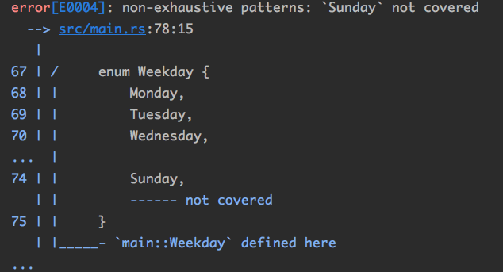
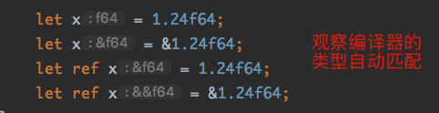
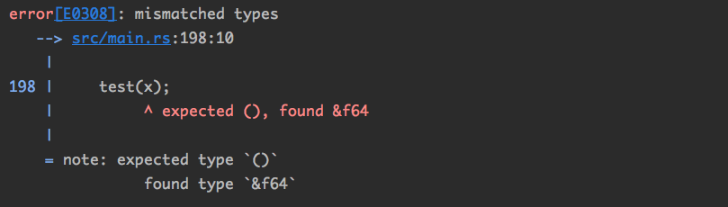
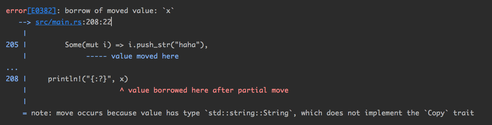

## 7.模式解构

模式解构是Rust中一个重要且实用的设计——Pattern Destructure。

注意：Destructure与Destructor是完全不同的概念。Destructure表示将原来的结构分解为单独的、局部的部分，而Destructor是指“析构器”，与Constructor对应，在对象被销毁的时候调用。

模式解构的例子：

```rust
		let tuple = (1024, 10.24f64, true);
    let (v1, v2, v3) = tuple;
```

在let语句中，赋值号左边内容就是所说的“模式”，赋值号右边的内容就是需要“解构”的内容。上面这个“模式”中引入了三个新变量v1/v2/v3，它们分别**绑定**了tuple中的三个成员。

Rust中**模式解构**功能设计得非常美观，**构造和解构遵循类似的语法**。看一个更复杂的例子：

```rust
		struct S1(i32, f64);
    struct S2 {
        a: S1,
        b: bool,
    }

    let s1 = S2 { a: S1(1, 1.024), b: true };
		// 模式解构
    let S2 { a: S1(v1, v2), b: v3 } = s1;
    println!("{} {} {}", v1, v2, v3)
// 1 1.024 true
```

从对象的构成上来看，成员越**复杂**，模式解构的**效率**越高。

Rust的“模式解构”功能不仅出现在let语句中，还可以在`match/if let/while let/函数调用/闭包调用`等情景中使用。

### 7.1 match

Demo:

```rust
		enum Weekday {
        Monday,
        Tuesday,
        Wednesday,
        Thursday,
        Friday,
        Saturday,
        Sunday,
    }

    fn print(d: Weekday) {
        match d {
            Weekday::Monday => {
                println!("Monday");
            }
            Weekday::Tuesday => {
                println!("Tuesday");
            }
            Weekday::Wednesday => {
                println!("Wednesday");
            }
            Weekday::Thursday => {
                println!("Thursday");
            }
            Weekday::Friday => {
                println!("Friday");
            }
            Weekday::Saturday => {
                println!("Saturday");
            }
            Weekday::Sunday => {
                println!("Sunday");
            }
        }
    }

    print(Weekday::Wednesday)
```

基础功能，可以等同于其他语言的switch语句理解。但是Rust的match表达式还有更强大的功能！

#### 7.1.1 exhaustive

删除match里的Weekday::Sunday分支，编译器会报错：



这是因为Rust要求match需要对所有情况做**完整的匹配**。exhaustive就是指无遗漏的、全面的意思，也是Rust模式匹配的重要特点。

那如果我不想把每种情况一一列出怎么办？可以用一个**下划线**来表达“除了已列出的之外的其他情况”，类似其他语言的`switch...default`:

```rust
fn print(d: Weekday) {
        match d {
            Weekday::Monday => {
                println!("Monday");
            }
            _ => {
                println!("Others")
            }
        }
    }
```

正因为这个特性，在多个项目之间存在依赖关系时候，上游库对enum增加成员是一种**破坏兼容性**的改动。

这是因为增添成员后，很可能会导致下游使用者match语句编译不过。

为了解决该问题，Rust提供了一个non_exhaustive功能：

```rust
		#[non_exhaustive]
    pub enum Weekday {
        Monday,
        Tuesday,
        Wednesday,
        Thursday,
        Friday,
        Saturday,
        Sunday,
    }
```

用"non_exhaustive"的attribute来标记一个enum或struct：当另外一个项目中使用这个类型时，无论如何在其项目中列举成员都无法实现完整匹配。必须使用**下划线**才能通过编译。

这样上游库里就可以随时为该类型增添成员并且不会导致下游项目编译出错。

#### 7.1.2 下划线

类似于Golang中的匿名变量，Rust中也可以用下划线来表示一个**占位符**。

```rust
		let t = (1, 2, 3);
    let (v1, _, v2) = t;
```

由于函数参数本身也具备“模式解构”功能，甚至可以简化这样的功能：

```rust
		struct S(i32, bool, f64);
// 原函数：
    fn func1(s: S) -> f64 {
        let S(v1, _, v2) = s;
        v1 as f64 + v2
    }
// 简化后：
		fn func2(S(v1, _, v2): S) -> f64 {
        v1 as f64 + v2
    }
```

注意：下划线更像个“关键字”，而不是普通“标识符”。编译器不会把单独的下划线当成一个正常的**变量名**处理。

但是在下划线后面跟上字母、数字或下划线，编译器就可以将其认为是一个**正常的标识符**。

```rust
		let __ = 2;
    println!("{}", __ + __); // 4
```

注：下面这两个语句具备不一样的意义。

```rust
		// 语句1		
		let _ = v;
		// 语句2
    let _x = v;
```

如果v是一个非Copy类型，语句1表示“忽略绑定”，此时会直接调用v的**析构函数**。我们在后面也不能使用下划线`_`来读取这个变量的内容了；语句2则表示“所有权转移”，\_x就是个正常的变量名。v的所有权转移到了\_x身上，\_x在后面仍可以使用。

除了下划线可以在模式中作为“占位符”，还有两个点`..`也可以在模式中作为“占位符”——下划线表示省略**一个元素**，两个点可以表示省略**多个元素**。

```rust
		let t = (1, 2, 3, 4, 5);
    let (v1, _, _, _, _) = t; // 1
    let (v2, ..) = t;// 1
    let (v3, .., v4) = t; // 1 5 胜率了中间的所有元素，只留头尾
```

#### 7.1.3 match也可做表达式

同前面讲的Rust流程控制语法一样，match语句同样可以是表达式的一部分：

```rust
 enum Color {
        Black,
        White,
        Red,
    }

    fn color_to_num(c: Color) -> i32 {
      // 后面没有分号，所以match的值会作为整个函数的返回值传递出去
      // match表达式做返回值
        match c {
            Color::Black => 100,
            Color::White => 200,
            Color::Red => 300,
        }
    }

    println!("{}", color_to_num(Color::Red))
```

match表达式的每个分支都可以是表达式，它们要么用大括号括起来，要么用逗号分开。

但是每个分支都必须具备**同样的类型**！

如果想要实现C/C++的**case穿透**或者Golang的**fallthrough**怎么办？

Rust中可以利用`|`来匹配多个条件：

```rust
		fn color_to_num(c: Color) -> i32 {
        match c {
            Color::Black | Color::White => 100,
            Color::Red => 300,
        }
    }
```

并且match不仅可以匹配**类型**，还可以匹配**值**和**条件**：

##### 7.1.3.1 匹配值

```rust
		fn color_to_num(c: i32) -> i32 {
        match c {
            1 | -1 => 100,
            0 => 200,
          // 注：匹配值的时候，一定要写 _ => ...
            _ => 300,
        }
    }
```

##### 7.1.3.2 匹配条件

```rust
		let x = 10;
    match x {
      // ..= 表示一个闭区间范围，前面说过
        0..=5 => println!("0-5"),
        6..=10 => println!("6-10"),
        11..=15 => println!("11-15"),
        _ => println!("others"),
    }
// 6-10
```

#### 7.1.4 match guards

match的判断处可以多加一个`if`作为“匹配看守”，当match和if都成功时，才执行后面的语句：

```rust
		let x = 10;
    match x {
        n if n <= 5 && n >= 0 => println!("0-5"),
        n if n <= 10 && n >= 6 => println!("6-10"),
        n if n <= 15 && n >= 11 => println!("11-15"),
        _ => println!("other"),
    }
```

为什么增加这样一个match功能呢？

因为编译器在对变量的值进行匹配时，它会保证“完整性”检查，但是该检查无法做到完美。因为编译器内部并没有一个完整的数学解算功能。

通过if，我们可以轻松地覆盖所有的情况。

值得注意的是，编译器将保证match的所有分支合起来一定覆盖了目标的**所有可能的情况**，但是并不会保证各个分支不存在**重叠**的情况。

```rust
		let x = 10;
    match x {
        n if n < 0 => println!("<0"),
        n if n > 1 => println!(">1"),
      // 有重叠的部分
        n if n < 2 && n > -1 => println!("<2 >-1>"),
        _ => unreachable!(),
    }
// >1
```

如果我们匹配的值同时符合多个分支，那么总会走**第一条**符合匹配的分支。

#### 7.1.5 变量绑定

Rust允许在每个match中对进行匹配的变量进行新的绑定：

我们可以使用`@`绑定变量。`@`前面是**新声明的变量**（用于后面的调用），后面是需要匹配的模式：

```rust
		let x = 2;
    match x {
        p @ 1..=5 => println!("{:?}", p), // p 就相当于一个新的x
        _ => println!("others"),
    }
```

如果一个模式的嵌套层次比较多时，一旦需要匹配更深层次作为匹配条件，希望绑定上一层的数据，就需要像下面这么写：

```rust
		fn func_match(x: Option<Option<i32>>) -> Option<i32> {
        match x {
          // p绑定到的是参数x的最内层的Option，其类型未Option<i32>
            Some(p @ Some(0..=5)) => p,
            _ => None,
        }
    }
    println!("{:?}", func_match(Some(Some(2)))); // Some(2)
    println!("{:?}", func_match(Some(Some(10)))); // None
```

如果想要`@`和`|`同时使用，一定要保证每个条件上都绑定这个名字：

```rust
		fn func_match(x: i32) {
        match x {
          // 每个条件都需要分别绑定名字
            p @ 1..=5 | p @ 7..=10 => println!("1..=5 | 7..=10:{:?}", p),
            _ => println!("other"),
        }
    }

    func_match(2);
    func_match(6);
```

#### 7.1.6 ref

如果需要绑定的是被匹配对象的引用，而不是被匹配对象的变量本身时，可以使用ref关键字。看看基本使用方法：

```rust
		let x = 1.024f64;
    match x {
        ref r => println!("{}", r),
    }
```

那为什么要多用`ref`来套这一层呢？

这是因为模式匹配的时候有可能发生变量的所有权转移，使用`ref`就是为了避免出现上述情况。

说到所有权，第一反应就是变量的引用`&`。那他们两有什么区别？



从表象上看 `ref x `就是对x取引用。

注意：

- `ref`是“模式”的 一 部分，它只能出现在赋值号**左边**
- `&`符号是**借用运算符**， 是表达式的一部分，它只能出现在赋值号**右边** 。

那他们在Rust底层是真的一样的么？可以利用编译器报错信息来看一下：

```rust
		// test函数的参数特意设置为空类型unit,我们传入的ref x 类型不是unit，所以编译器一定会报错。通过报错信息来断定底层的 ref x 的类型
		fn test(_: ()) {}
    let ref x = 1.024f64;
    test(x);
```



以上的调试手法是一种非常好的判断复杂类型的解决方案，今后大家也可以多多使用。

通过上面的调试结果，可以断定`ref x` 与 `&x `相同。

#### 7.1.7 mut

`mut`关键字也是“模式”的一部分，也是只能出现在**赋值号左侧**。

Rust中所有的变量绑定默认都是**只读**，即不可修改的。只有使用了mut修饰的变量绑定才可以修改数据。

```rust
		let x = 1;
    x = 2; // 编译报错：error[E0384]: cannot assign twice to immutable variable `x`

		let mut x = 1;
    x = 2; // 通过编译
```

使用mut修饰的变量绑定，可以重新绑定到其他**同类型的变量**，但是不能绑定**不同类型的变量**。

```rust
		let mut x = [0; 5];
    x = [1; 6];// 编译报错：error[E0308]: mismatched types
    x = [1; 5];// 通过编译
```

这个mut变量绑定（宏观上可理解为修改）与最前面提到的“变量遮掩”是完全不同的机制：

- “重新绑定”要求变量本事有mut修饰且无法改变该变量的类型；
- “变量遮掩”要求必须重新声明一个新的变量，其与老变量之间没有任何关系。

在变量可变性方面，可以直接看出Rust与C++设计的不同：

Rust默认是不可修改，如果想修改那请加`mut`；C++正好相反，默认是可修改，不想让修改加`const`。

`mut`关键字不仅可以用于修饰变量绑定，还能修饰引用（指针）。看下面的例子：

```rust
let mut x: &mut f64;
// 这里的变量声明中出现了两个mut,他们的含义完全不同。
// 第一个mut:表示x这个变量是可修改的 -> x能够重新绑定到另外一个变量上面去
// 第二个mut:&mut 修饰的是指针，说明这个指针对于内存具有修改能力 -> 可以使用 *x=2.2f64; 语句来修改它指向内存的值。
```

mut关键字其实很复杂，这样就会导致各种与mut相关的编译错误。这里只简单介绍了它的语法，至于其深层次的含义即正确使用方法，在后面会详细说明。

那为什么有的场景必须使用`ref`来进行变量绑定呢？这背后与“move”语义有关。关于变量的生命周期、所有权、借用和move等概念，还是在后面会详细说明。

先看个小例子：

```rust
		let mut x: Option<String> = Some("michael.w".into());
    match x {
        Some(i) => i.push_str("haha"),
        None => println!("None")
    }
    println!("{:?}", x)
```

编译器报错: error[E0596]: cannot borrow `i` as mutable, as it is not declared as mutable

因为i是不可修改的，无权调用push_str()方法。修改一下：

```rust
let mut x: Option<String> = Some("michael.w".into());
    match x {
        Some(mut i) => i.push_str("haha"),
        None => println!("None")
    }
    println!("{:?}", x)
```

编译器报错: 



按照报错信息来看，编译器认为这个match语句把内部的String变量给移动出来了，导致后面打印x的时候出错。

为了保证这个match语句不发生变量的移动，所以我们需要把模式中的变量i用`ref`修饰：

```rust
let mut x: Option<String> = Some("michael.w".into());
    match x {
      // 此处将模式中的修饰成ref mut
        Some( ref mut i) => i.push_str("haha"),
        None => println!("None")
    }
    println!("{:?}", x) // Some("michael.whaha")
// 通过编译
```

其实还要一种更简单的修复方式，就是在match入口处做限制：

```rust
		let mut x: Option<String> = Some("michael.w".into());
    match &mut x {
        Some(i) => i.push_str("haha"),
        None => println!("None")
    }
    println!("{:?}", x)
// 同样通过编译
```

因为这次不是对变量x进行模式匹配，而是对指针进行模式匹配。所以编译会自动为变量i加了`ref mut`。

这是Rust编译器专门做的一个辅助功能。当类型嵌套层次很多的时候，时时要关心哪个模式需要加mut或ref是非常费脑筋的。有了这个功能之后，编译器就会自动合理地使用`mut`或`ref`。

### 7.2 if-let/while-let

Rust在let语句中同样可以应用同样的模式。Rust还提供了if-let语法糖——`if let PATTERN = EXPRESSION {BODY}`，后面可以跟一个可选的else分支。

假如现在有一个类型为`Option<T>`的变量v，要取出里面的值，可以这样操作：

```rust
		let v = Some(1024);
    match v {
      // 在该分支内做处理X操作
        Some(x) => { funcWithX(x) }
        _ => { ... }
    }
```

上面这种表达比较冗长，从模式匹配开始到真正执行处理有两层缩进。为了简化，还可以这么做（利用Option类型的类方法）：

```rust
		let v = Some(1024);
    // 判断x是一个Some(_)
    if v.is_some() {
        // 取出v中的内部数据
        let x = v.unwrap();
        funcWithX(x);
    }
```

视觉上，代码缩进层次减少了一层，但是实际上在运行期还是对v进行了两次判断：v.is_some()和v.unwrap()。执行效率上来说是降低了。

使用if-let语法：

```rust
		let v = Some(1024);
// 只是一个简单的语法糖，与match表达式相比，效率并无差别。
    if let Some(x) = v {
        funcWithX(x);
    }
```

`if-let`跟`match`的区别：`match`一定要完整匹配，而`if-let`只需要关注你感兴趣的那个分支即可。

同理，while-let提供了在while语句中使用“模式解构”的能力，此处不举例。

### 7.3 函数与闭包参数的模式解构

这部分很好理解，即一个函数接受一个结构体做参数，可以直接在参数这里做模式解构：

```rust
		struct S {
        a: i32,
        b: f64,
        c: bool,
    }
		// 函数在参数处做模式解构
    fn test(S { a: v1, b: v2, c: v3 }: S) {
        println!("{} {} {}", v1, v2, v3);
    }

    let x = S { a: 1, b: 1f64, c: true };
    test(x);
```

综上所述，“模式解构”是Rust中较为复杂的一个功能，但是非常实用!

当然个人感觉，不使用模式解构同样可以来写Rust程序，但是了解这部分机制很大程度上是为了能看懂别人的代码。

