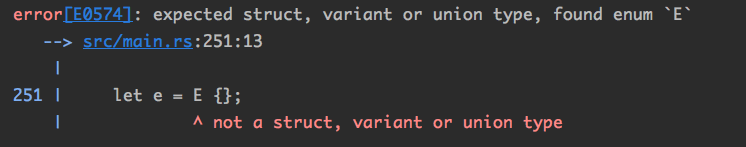

## 8.Rust的类型系统

Rust的类型系统实际上是一种**代数类型系统** (Algebraic data type)。 它在数学上是有严格定义的，非常严谨的一套理论。 

### 8.1 白话代数类型系统

在代数里面，变量x代表某个集合内的数字，执行的操作一般是加减乘除一类的数学运算 。 

对应到代数类型系统上，可以把**类型**类比为代数中的变量， 把**类型之间的组合关系**类比为代数中的数学运算 。

做这样的假定，一个类型所有的取值可能性叫做这个类型的“基数”。所以可以得出结论：

- Rust中最简单的类型unit()基数就是1，因为只有1种取值，即`()`;
- bool类型的基数就是2 -> 只有true或false；
- i32类型的基数就是2^32。

当将多个类型组合到一起形成**复合类型**时，这个类型就会有新的基数。如果两个类型的基数是一样的，那么我们可以说他们携带的**信息量**是一样的，也可以说他们是**同构**的。

看个例子：

```rust
// 数组（2元素）
type T1 = [i32; 2];
// tuple
type T2 = (i32, i32);
// tuple struct
struct T3(i32, i32);
// struct
struct T4 {
    a: i32,
    b: i32,
}
```

上面四个类型是四种完全无法通用的类型，但是从数学上将，这四个类型携带的信息量是完全相同的，即：2^32*2^32。

tuple/struct/tuple struct是三种不同的类型，实际上拥有相同的内存布局，唯一的区别是：是否给类型和成员起名字。

数组类型可以对应为每个成员类型都相同的tuple类型(或是struct)，具备代数的**乘方关系**。enum类型具备代数中的**求和关系**。

标准库中有一个极其常见的类型`Option<T>`，定义如下：

```rust
pub enum Option<T> {
    /// No value
    #[stable(feature = "rust1", since = "1.0.0")]
    None,
    /// Some value `T`
    #[stable(feature = "rust1", since = "1.0.0")]
    Some(#[stable(feature = "rust1", since = "1.0.0")] T),
}
```

由于它实在是太常用，标准库将 Option 以及它的成员 Some、 None 都加入到了Prelude 中， 用户甚至不需要 **use语句**声明就可以直接使用。 其中T是一个**泛型参数**，在使用 的时候可以被替换为实际类型 。

从这结构定义来看，`Option<T>`的基数就是：T的基数+1。

enum类型的每个成员还允许包含更多关联数据：

```rust
enum Enum {
    A,
    B(i32, i32),
    C { x: i32, y: i32, z: i32 },
}
```

由此可知，Enum类型的基数为：1+(2^32)^2+(2^32)^3。

### 8.2 Never Type

考虑一个类型在**机器层面**的表示方式——一个类型占用的**bit位数**可以决定它能携带多少信息。

一种类型占用bit位，那么他的基数就是2^bit；反之，一个类型如果基数为x，那么存储它至少需要log2(x)位。

之前有人提过问题unit这样的空类型有什么作用？

答： unit类型和没有成员的空struct类型都可以类比为代数中的数字1。这样的类型在内存中实际需要占用的空间为log2(1)=0。这样的性质有很多好处，比如Rust里面的HashSet：

```rust
#[derive(Clone)]
#[stable(feature = "rust1", since = "1.0.0")]
pub struct HashSet<T, S = RandomState> {
  // value指定为()
    map: HashMap<T, (), S>,
}
```

只要把HashMap中存储KV对的value指定为unit类型就成为了HashSet。细想一下，所谓的HashSet就是只有key没有value的HashMap，如果Rust中没有真正意义上的**0大小类型**，这种设计是无法做到如此简洁的。

现在来看没有成员的enum类型：

```rust
enum E {}
```

如果我想要声明一个这种类型的变量是根本做不到的

```rust
let e = E {};
```

编译报错：



假设空enum的基数是0，那么他的存储需要位数为log2(0)=负无穷，也就是说逻辑上是**不可能存在**的。

这样的类型在Rust类型系统中叫做never type，它们具有一些特殊的属性：

- 运行时根本不可能存在，因为没有语法可以构造出这样的变量；
- 基数为0；
- 处理该类型的代码根本不可能执行；
- 返回这种类型的代码根本不可能返回；
- 可以被转换为任意类型。

这种类型的存在是为了在类型系统层面得到**统一**：

```rust
		let y = 1;
    loop {
        let x = if y < 0 { 1 } else { continue; };
    }
```

never type可以转换为**任意类型** ，所以 ，它可以使x的赋值过程符合与if分支的类型相一致的规定。

所以说，never type是Rust类型系统中不可缺少的一部分。 一般用空tuple——`()`代表unit类型。

Rust里面其实也有一个专门的类型来表示never类型的，就是前面提到过的感叹号 `!`。

### 8.3 Rust对传统空指针问题的解决方案

没错，就是Option类型。

目前许多编程语言中，都存在一个很有意思的**特殊指针**或引用，它代表指向的对象为**空**。比如golang中的nil，C++中的nullptr，java中的null，python中的None。（java和python中没有指针的概念，表示一个对象是空）

以java为例，作如下操作：

```java
String str = null;
```

所有调用了str的函数都会抛出一个NullPointerException，如果不catch，程序就会崩溃掉。这一类问题已经造成业界无法估量的巨大损失。

空指针实际上是在类型系统上额外打开了一个缺口，引入一个必须在**运行期**特殊处理的特殊“值”。就像一个全局的、无类型的singleton变量一样无处不在，可以随意与任意指针实现自动转换。这使得编译器的类型检查对其毫无感知。

Rust是如何解决空指针的问题的呢？

答：就是利用类型系统将**空指针**和**非空指针**区分开，并赋予它们不同的操作权限——禁止针对空指针执行**解引用**操作。

任何语言的编译器和静态检查工具都不可能知道一个变量在运行期的值，但是可以检查所有变量的**类型**来判断其是否符合**类型系统的各种约束**。

Rust将null从一个“值”上升到一个“类型”，使得静态检查就可以发挥作用了。

```rust
pub enum Option<T> {
    // No value
    None,
    // Some value `T`
    Some(#[stable(feature = "rust1", since = "1.0.0")] T),
}
```

如何做到对空指针的检查？

Rust对enum的要求，在使用的时候必须“**完整匹配**”——即前面说的match，必须把每一种可能性都匹配到。对于一个可控的`Option<T>`类型，**程序员是没有办法直接调用T类型的成员函数**，只有两种方法能取到其中的内容：

1. 用**模式匹配**把其中的类型T内容拆出来（enum的完整匹配注定会在None检测出来）；
2. 调用Option类型的成员方法。同样对None做了match。

```rust
		pub fn unwrap(self) -> T {
        match self {
            Some(val) => val,
            None => panic!("called `Option::unwrap()` on a `None` value"),
        }
    }
```

所以，没有人可以在Rust中从一个`Option<T>`对象中取出一个空值。

对于普通非空类，Rust不允许赋值为None，也不允许不初始化就使用，并且在Rust中也没有null/nil这样的关键字。所以，想利用Rust生成一个**空指针**也几乎是不可能的。

个人认为，以上也是Rust安全性保证的根本原因。

注：Option类型提供了非常方便的成员函数，另外我们还可以利用 if-let、 while-let 等**语法糖**。 许多情况下，没必要每次都自己手动调用match语句(标准库都封装好了)。

建议大家查阅一下**标准库的文档**，对成员方法烂熟于心。

#### 8.3.1 Option类型的高效

Option类型不仅在表达能力上非常优秀（上面分析过了），而且运行开销也非常小。看个测试demo：

```rust
		use std::mem::size_of;
    println!("{}", size_of::<isize>());        				// 8
    println!("{}", size_of::<Option<isize>>());				// 16

    println!("{}", size_of::<&isize>());							// 8
    println!("{}", size_of::<Box<isize>>());					// 8

    println!("{}", size_of::<Option<&isize>>());			// 8
    println!("{}", size_of::<Option<Box<isize>>>());	// 8

    println!("{}", size_of::<*const isize>());				// 8
    println!("{}", size_of::<Option<*const isize>>());// 16
```

上面不带Option的类型大小都是8，等于该平台上一个指针占用的空间大小。

`Option<isize>`实际表示的含义是——**可能为空的整数**。除了存储一个isize外，还需要一个标记位(至少1bit)来表示该值存在还是不存在。这里打印长度为16，这是内存对其导致。

最不可思议的是`Box<isize>`和`Option<Box<isize>>`占用的空间竟然和一个&isize**一样**！并未多浪费一点空间来标识“指针是否为空” 的状态。

这是Rust的一个小优化：Rust的设计中，**借用指针&**和**所有权指针Box**从语义上来说，都是不可能为0的，即有些数值是根本不可能成为这些指针指向的地址的。所以，`Box<isize>`和`Option<Box<isize>>`利用这个特点使用“0”值代表当前状态为空。

这意味着：**Rust编译后的机器码中，使用Option类型对指针的包装，与C/C++的指针完全没有区别**。

综上所述：

- 从逻辑上说，如果需要一个变量是可空的，那么就应该显式标明其类型为`Option<T>`,否则应该直接声明为T类型 ；
- 不要轻易使用`Option<T>`类型的**unwrap方法**，因为会导致panic（上面有源码）。对于自己写小工具倒是无妨，但是在正式大项目中，最好是禁止调用该方法；
- 关于裸指针，使用Option包装的指针类型的执行效率**不会降低**——“零开销抽象”；
- 不必担心使用Option类型会导致大量match语句的出现。因为`Option<T>`类型提供了很多**成员函数**，使得表达能力和可读性上都比程序员自己手动match更胜一筹。