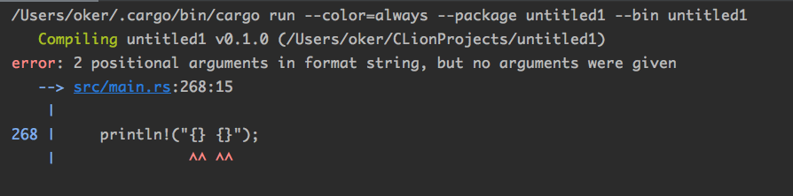
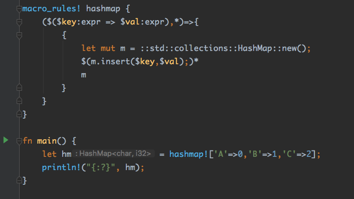
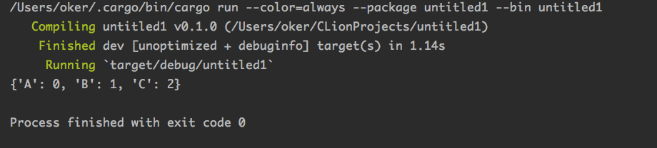

## 9.宏

“宏”（macro）是Rust的一个重要特性 。macro是一种**编译器扩展**，它的调用方式为`some_macro!(...)`。

宏调用与函数调用的区别：凡是宏调用后面都跟着一个**感叹号** 。

注：宏也可以通过`some_macro! [...]` 和 `some_macro !{...}`两种语法调用，只要括号能正确匹配即可 。

### 9.1 Rust宏与C/C++的区别

与C/C++中的宏不一样的是，Rust中的宏是一种比较安全的“卫生宏”(hygiene)。 

1. Rust宏在调用的时候跟函数有明显的语法区别;
2. Rust宏的内部实现和外部调用者处于**不同名字空间**，它的访问范围严格受限。不能随意在宏内访问和改变外部的代码；
3. C/C++中的宏只在预处理阶段起作用，因此只能实现类似文本替换的功能（有的时候比较长的宏没加好括号可能直接导致程序逻辑修改）。 而 Rust宏在语法解析之后起作用，因此可以获取更多的上下文信息，而且更加安全 。

### 9.2 编译阶段检查

```rust
println!("{} {}");
```



调用宏时，参数没给够。使用宏可以在编译阶段分析字符串常量和对应参数，确保它**符合约定** 。

注：另外一个常见场景——利用宏来检查**正则表达式**的正确性 

### 9.3 编译阶段计算

```rust
println!("{} {}", file!(), line!());
// src/main.rs 268
```

打印出当前源代码的文件名，以及当前代码的行数。这些信息都是**纯编译阶段**的信息。

### 9.4 自动代码生成

许多代码具有同样的“模式”，但是它们不能用现有的**语法工具**，如“函数”“泛型”“trait”等对其进行合理抽象 。 

```rust
#[derive(Copy, Clone, Default, Debug, Ord, PartialOrd, PartialEq, Hash, Eq)]
struct S {
    a: i32,
    b: i32,
}
```

### 9.5 实现语法拓展

可以使用Rust宏来设计比较方便的**语法糖**，而不必使用编译器内部硬编码来实现：

```rust
		// Rust生成一个动态数组
		let mut v1 = Vec::new();
    v1.push(1);
    v1.push(2);
		// 利用Rust宏生成一个动态数组
    let v2 = vec![1, 2];
    println!("{:?} {:?}", v1, v2);
		// [1, 2] [1, 2]
```

### 9.6 如何使用macro_rules!实现自定义宏

`macro_rules!`是**标准库**中为我们提供的一个编写简单宏的小工具， 它本身也是用编译器扩展来实现的 。 

让我们一起写一个`hashmap!`宏，实现直接生成HashMap的功能，过程如下：

####  9.6.1 定义宏名字

```rust
macro_rules! hashmap {
}
```

#### 9.6.2 添加语法定义表示符

```rust
macro_rules! hashmap {
    ($key:expr => $val:expr) => {
    	()
    }
}
```

在大括号中定义宏的使用语法以及它展开后的形态。语法类似match语句： expander => {transcriber}。

左边是**宏扩展的语法定义**，右边是**宏扩展的转换机制**。

语法定义的**标识符**以$开头，类型支持`item、block、stmt、pat、expr、ty、itent、path、tt`，我需要一个表达式，一个 " => "标识符，再跟一个转换后的表达式。

#### 9.6.3 添加语句块

```rust
macro_rules! hashmap {
    ($key:expr => $val:expr) => {
      {
      let mut m = ::std::collections::HashMap::new();
      m.insert($key,$val);
      m
      }
    }
}
```

进一步添加宏转换后的**代码**进一个**语句块**。

#### 9.6.4 元素重复

9.6.3中我已实现了一个`hashmap!['A'=>0];`这样的宏语法了。但是希望在宏支持**重复多个**这样的语法元素，可以使用`+`和`*`——同正则表达式。

注：`+`代表1或多，`*`代表0或多。

```rust
macro_rules! hashmap {
    ($($key:expr => $val:expr),*)=>{
      {
      let mut m=::std::collections::HashMap::new();
       // 该处会被拓展成多条insert语句
      $(m.insert($key,$val);)*
      m
      }
    }
}
```

运行检验一下：



运行结果：



这样，一个人自定义宏就诞生了！

#### 9.6.5 如何检查一下宏展开的情况

使用rustc的内部指令：

```shell
rustc -Z unstable-options --pretty=expanded main.rs
```

输出结果：

```rust
#![feature(prelude_import)]
#![no_std]
#[prelude_import]
use ::std::prelude::v1::*;
#[macro_use]
extern crate std;
macro_rules! hashmap {
    ($ ($ key : expr => $ val : expr), *) =>
    {
        {
            let mut m = std :: collections :: HashMap :: new () ; $
            (m . insert ($ key, $ val) ;) * m
        }
    }
}

fn main() {
    let hm =
        {
            let mut m = std::collections::HashMap::new();
            m.insert('A', 0);
            m.insert('B', 1);
            m.insert('C', 2);
            m
        };
    {
        ::std::io::_print(::core::fmt::Arguments::new_v1(&["", "\n"],
                                                         &match (&hm,) {
                                                              (arg0,) =>
                                                              [::core::fmt::ArgumentV1::new(arg0,
                                                                                            ::core::fmt::Debug::fmt)],
                                                          }));
    };
}

```

可以通过这种方式实现很大一部分宏，它比较适合写那种一个**模子**套用出来的**重复代码**。

